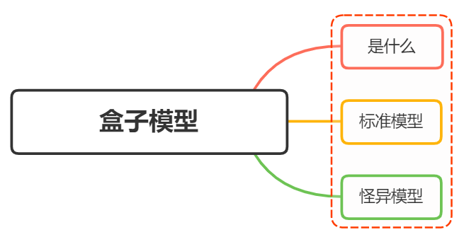
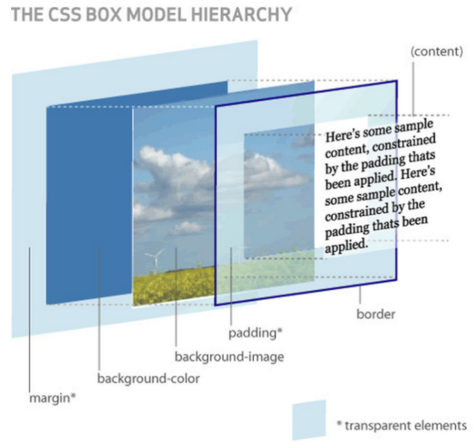

# Box Model (盒子模型)



## 是什么

当对一个文档进行布局（layout）的时候，浏览器的渲染引擎会根据标准之一的 `CSS` 基础盒型模块（CSS basic box model），将所有元素标识为一个个矩形的盒子（box）

一个盒子有四部分组成： `content` 、 `padding` 、 `border` 、 `margin`


- `content` ：即实际内容，显示文本和图像
- `border` ：即边框，围绕元素内容的内边距的一条或多条线，由粗细、样式、颜色三部分组成
- `padding` ：即内边距，清除内容周围的区域，内边距是透明的，取值不能为负，受盒子的 `background` 属性影响
- `margin` ：即外边距，在元素外创建额外的区域，通常只不能放其他元素的区域

上述是一个从二维的角度观察盒子，下面在看看三维图：



下面这段代码：

```html
<div class="box">Box Model</div>

<style lang="scss">
  .box {
    width: 200px;
    height: 100px;
    padding: 20px;
    background: yellow;
  }
</style>
```

<div class="box_model">
  <div class="box content-box">
    Box Model
  </div>
</div>

当我们在浏览器查看元素时，却发现元素的大小变成了 `240px`

这是因为，在 `CSS` 中，盒子模型可以分成：

- `W3C` 标准盒子模型
- `IE` 怪异盒子模型

在默认情况下，盒子模型为 `W3C` 标准盒子模型

## 标准盒子模型

标准盒子模型，是浏览器默认的盒子模型

下面是标准盒子模型的模型图：


从上图可以看到：

- 盒子总宽度 = width + padding + border + margin ；
- 盒子总高度 = height + padding + border + margin；

也就是， `width/height` 只是内容高度，不包含 `padding` 和 `boder`

所以上面问题中，设置 `width` 为 200px，但由于存在 `padding` ，实际上盒子的宽度有 240px

## IE 怪异盒子模型

同样看看 IE 怪异盒子模型的模型图


从上图可以看到：

- 盒子总宽度 = width + margin ；
- 盒子总高度 = height + margin；

也就是， `width/height` 包含了 `padding` 和 `boder`

## box-sizing

CSS 中的 `box-sizing` 属性定义了引擎该使用如何计算一个元素的总宽度和总高度

语法：

```css
box-sizing： content-box | border-box | inherit
```

- `content-box` ：默认值，元素的 `width/height` 不包含 `padding` 、`border` ，与标准盒子模型表现一直
- `border-box` ：元素的 `width/hieght` 包含 `padding` 、 `border` ，与怪异盒子模型表现一直
- `inherit` ：指定 `box-sizing` 属性的值，应该从父元素继承

回到上面的例子里，设置盒子为 border-box 模型

```html
<div class="box border-box">Box Model</div>

<style lang="scss">
  .border-box {
    box-sizing: border-box;
  }
</style>
```

<div class="box_model">
  <div class="box border-box">
    Box Model
  </div>
</div>

## 参考

- [CSS Box Model](https://developer.mozilla.org/en-US/docs/Web/CSS/CSS_Box_Model/Introduction_to_the_CSS_box_model)
- [box-sizing](https://developer.mozilla.org/en-US/docs/Web/CSS/box-sizing)
- https://vue3js.cn/interview/css/box.html

<style lang="scss">
.box_model {
  .box {
    width: 200px;
    height: 100px;
    padding:20px;
    background: yellow;
  }

  .content-box{
    box-sizing: content-box;
  }

  .border-box {
    box-sizing: border-box;
  }
}
</style>
