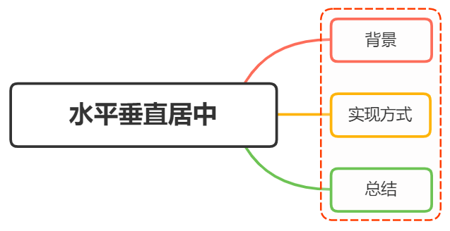

# Center element horizontally and vertically

<br>
<h1>元素⽔平垂直居中的⽅法有哪些？如果元素不定宽⾼
呢？</h1>



## 背景

在开发中经常遇到这个问题，即让某个元素的内容在水平和垂直方向上居中，内容不仅限于文字，可能是图片、图标、按钮、表单等等

居中是一个非常基础但又是非常重要的应用场景，实现居中的方法存在很多，可以将这些方法分成两类：

- 居中元素（子元素）已知宽高
- 居中元素（子元素）未知宽高

## 实现方式

实现水平元素垂直居中的方式：

- 利用定位 + `margin:auto`
- 利用定位 + `margin:负值`
- 利用定位 + `transform`
- 利用 `table` 布局
- 利用 `flex` 布局
- 利用 `grid` 布局

### 定位 + `margin:auto`

::: details code example: 定位 + `margin:auto`

```html
<style>
  .father {
    width: 500px;
    height: 300px;
    border: 1px solid #0a3b98;
    position: relative;
  }
  .son {
    width: 100px;
    height: 40px;
    background: #f0a238;
    position: absolute;
    top: 0;
    left: 0;
    right: 0;
    bottom: 0;
    margin: auto;
  }
</style>
<div class="father">
  <div class="son"></div>
</div>
```

<div :class="$style['father-auto']">
  <div :class="$style['son-auto']"></div>
</div>

父级设置为相对定位，子级设置为绝对定位，并且四个定位属性都设置为 `0` ，那么这时候如果子级没有设置宽高，则会被拉开到父级一样的宽高

这里子元素设置了宽高，所以宽高会按照我们的设置来显示，但是实际上子元素的虚拟点位已经撑满了整个父级，这时候再给他一个 `margin: auto` ，就会让他在父级中水平垂直居中

:::

### 定位 + `margin:负值`

::: details code example: 定位 + `margin:负值`

绝大多数情况下，设置父元素为相对定位，子元素移动自身 50% 实现水平垂直居中

```html
<style>
  .father {
    width: 500px;
    height: 300px;
    border: 1px solid #0a3b98;
    position: relative;
  }
  .son {
    width: 100px;
    height: 40px;
    background: #f0a238;
    position: absolute;
    top: 0;
    left: 0;
    right: 0;
    bottom: 0;
    margin: auto;
  }
</style>
<div class="father">
  <div class="son"></div>
</div>
```

<div :class="$style['father-negative']">
  <div :class="$style['son-negative']"></div>
</div>

整个实现思路如下图所示：


- 初始位置为 方块 1 的位置
- 当设置 left 、 top 为 50% 时，内部子元素为 方块 2 的位置
- 当设置 margin 为 负值时，使内部子元素到方块 3 的位置，即中间位置

这种方案不要求父元素的高度，也就是即使父元素的高度变化了，仍然可以保持父元素的垂直居中位置，水平方向上是一样的操作

但是该方案需要知道子元素的宽高

:::

### 定位 + `transform`

::: details code example: 定位 + `transform`
实现代码如下：

```html
<style>
  .father {
    position: relative;
    width: 200px;
    height: 200px;
    background: skyblue;
  }
  .son {
    position: absolute;
    top: 50%;
    left: 50%;
    transform: translate(-50%, -50%);
    width: 100px;
    height: 100px;
    background: red;
  }
</style>
<div class="father">
  <div class="son"></div>
</div>
```

<div :class="$style['father-translate']">
  <div :class="$style['son-translate']"></div>
</div>

`translate(-50%, -50%)` 会将元素位移自己的宽度和高度的 -50%

这种方法其实和上面的 `margin:负值` 方案是一样的，只不过是利用了 `transform` 的特性来实现，可以说是 `margin:负值` 的替代方案，并不需要知道自身的宽高

:::

### `table` 布局

::: details code example: `table` 布局

设置父元素为 `diaplay: table-cell` ，子元素设置 `display: inline-block` 。利用 `vertical-align` 和 `text-align` 可以让所有的行内块级元素水平垂直居中

```html
<style>
  .father {
    display: table-cell;
    width: 200px;
    height: 200px;
    background: skyblue;
    vertical-align: middle;
    text-align: center;
  }
  .son {
    display: inline-block;
    width: 100px;
    height: 100px;
    background: red;
  }
</style>
<div class="father">
  <div class="son"></div>
</div>
```

<div :class="$style['father-table']">
  <div :class="$style['son-table']"></div>
</div>

:::

### `flex` 布局

::: details code example: `flex` 布局

```html
<style>
  .father {
    display: flex;
    justify-content: center;
    align-items: center;
    width: 200px;
    height: 200px;
    background: skyblue;
  }
  .son {
    width: 100px;
    height: 100px;
    background: red;
  }
</style>
<div class="father">
  <div class="son"></div>
</div>
```

<div :class="$style['father-flex']">
  <div :class="$style['son-flex']"></div>
</div>

`css3` 中 `flex` 布局，可以非常简单实现垂直水平居中

这里可以简单看看 `flex` 布局的关键属性作用：

- `display: flex` 将父元素设置为 `flex` 布局
- `justify-content: center` 将子元素水平居中
- `align-items: center` 将子元素垂直居中

:::

### `grid` 布局

::: details code example: `grid` 布局

```html
<style>
  .father {
    display: grid;
    /* align-items: center;
    justify-content: center; */
    place-items: center;
    width: 200px;
    height: 200px;
    background: skyblue;
  }
  .son {
    width: 100px;
    height: 100px;
    border: 1px solid red;
  }
</style>
<div class="father">
  <div class="son"></div>
</div>
```

<div :class="$style['father-grid']">
  <div :class="$style['son-grid']"></div>
</div>

在父元素上设置 `display: grid` ，然后在父元素上设置 `align-items: center` 和
`justify-content: center` ，就可以实现子元素的水平垂直居中，也可以使用
`place-items: center` 来实现
:::

### 小结

上述方法中，不知道元素宽高大小仍能实现居中的方法有：

- 定位 + `margin:auto`
- 定位 + `transform`
- `table` 布局
- `flex` 布局
- `grid` 布局

## 总结

根据元素标签的性质，可以分为：

- 内联元素居中布局
- 块级元素居中布局

### 内联元素居中布局

水平居中

- 行内元素：`text-align: center`
- `flex` 布局设置父元素：`display: flex` 、 `justify-content: center`

垂直居中

- 单行文本元素确定高度：`line-height: height`
- 多行文本元素确定高度：`display: table-cell` 、 `vertical-align: middle`

### 块级元素居中布局

水平居中

- 定宽元素：`margin: 0 auto`
- 绝对定位元素：`left: 50%` 、 `transform: translateX(-50%)` (或 `margin-left: -width/2` )

垂直居中

- `position: absolute` 设置 `left` 、`top` 、`margin` (定高)
- `display: table-cell`
- `transform: translate(x, y)`
- `flex` (不定高，不定宽)
- `grid` (不定高，不定宽)，兼容性相对比较差

## 参考

- [Flex 布局教程](https://www.ruanyifeng.com/blog/2015/07/flex-grammar.html)
- [CSS Grid 网格布局教程](https://www.ruanyifeng.com/blog/2019/03/grid-layout-tutorial.html)
- [生成 Grid 布局工具](https://cssgrid-generator.netlify.app/)
- https://juejin.cn/post/6844903982960214029#heading-11
<style module lang="scss">
  .father-auto {
    width: 500px;
    height: 300px;
    border: 1px solid #0a3b98;
    position: relative;
  }
  .son-auto {
    width: 100px;
    height: 40px;
    background: #f0a238;
    position: absolute;
    top: 0;
    left: 0;
    right: 0;
    bottom: 0;
    margin: auto;
  }

  .father-negative {
    width: 500px;
    height: 300px;
    border: 1px solid #0a3b98;
    position: relative;
  }
  .son-negative {
    width: 100px;
    height: 40px;
    background: #f0a238;
    position: absolute;
    top: 0;
    left: 0;
    right: 0;
    bottom: 0;
    margin: auto;
  }

  .father-translate {
    position: relative;
    width: 200px;
    height: 200px;
    background: skyblue;
  }
  .son-translate {
    position: absolute;
    top: 50%;
    left: 50%;
    transform: translate(-50%, -50%);
    width: 100px;
    height: 100px;
    background: red;
  }

  .father-table {
    display: table-cell;
    width: 200px;
    height: 200px;
    background: skyblue;
    vertical-align: middle;
    text-align: center;
  }
  .son-table {
    display: inline-block;
    width: 100px;
    height: 100px;
    background: red;
  }

  .father-flex {
    display: flex;
    justify-content: center;
    align-items: center;
    width: 200px;
    height: 200px;
    background: skyblue;
  }
  .son-flex {
    width: 100px;
    height: 100px;
    background: red;
  }

  .father-grid {
    display: grid;
    /* align-items: center;
    justify-content: center; */
    place-items: center;
    width: 200px;
    height: 200px;
    background: skyblue;
  }
  .son-grid {
    width: 100px;
    height: 100px;
    border: 1px solid red;
  }
</style>
