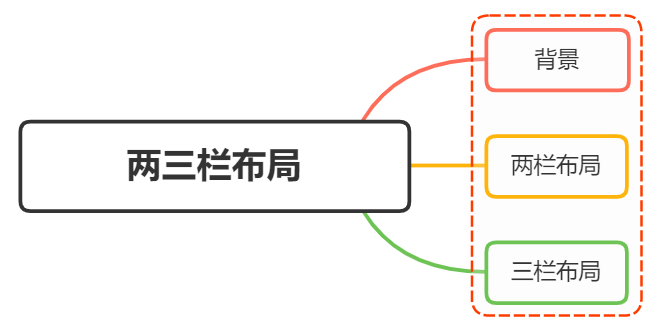
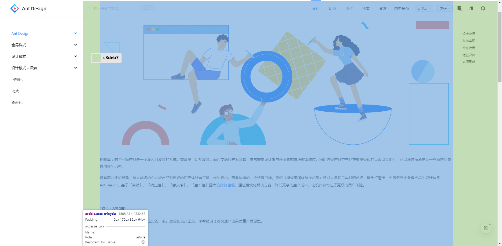
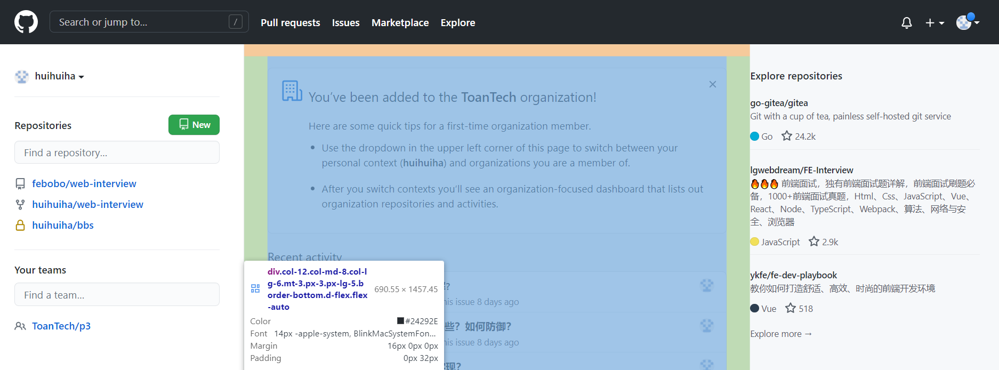

# multi-column layout (多栏布局)

<br>
<h1>实现两栏布局，右侧自适应？三栏布局中间自适应呢？</h1>



## 背景

在日常布局中，无论是两栏布局还是三栏布局，都是非常常见的布局方式

### 两栏布局

两栏布局实现效果就是将页面分割成左右宽度不等的两列，宽度较小的列设置为固定宽度，剩余宽度由另一列自适应填充

比如 [`Ant Design`](https://ant.design/index-cn) 文档，蓝色区域为主要内容布局容器，侧边栏为次要内容布局容器

> 这里称宽度较小的列父元素为次要布局容器，宽度较大的列父元素为主要布局容器



这种布局适用于内容上具有明显主次关系的网页

### 三栏布局

三栏布局按照左中右的顺序进行排列，通常中间列最宽，左右两列次之
大家最常见的就是 [`Github`](https://github.com/)

> Github 更新了布局，现在是两栏布局，右侧为主要内容布局容器，左侧为次要内容布局容器



## 两栏布局

两栏布局非常常见，往往是以一个定宽的侧边栏为次要内容布局容器，剩余宽度的主要内容布局容器自适应填充

实现思路也非常的简单：

### `float` 浮动

- 使用 `float` 左浮动左边栏
- 右边模块设置 `margin-left` 撑出内容块做内容展示
- 为父级元素设置 `BFC` ，防止下文元素飞到上方内容

代码如下：

```html
<style>
  .box {
    overflow: hidden; /* 添加BFC */
  }
  .left {
    float: left;
    width: 200px;
    background-color: gray;
    height: 400px;
  }
  .right {
    height: 400px;
    margin-left: 120px;
    background-color: lightgray;
  }
</style>
<div class="box">
  <div class="left">左边</div>
  <div class="right">右边</div>
</div>
```

::: details 点击查看效果 `float` 实现两栏布局

<div :class="[$style.box, $style['hidden']]">
  <div :class="[$style.left, $style['float-left']]">左边</div>
  <div :class="[$style.main, $style['ml-120']]">右边</div>
</div>

:::

还有一种更为简单的使用则是采取： `flex` 弹性布局

### `flex` 弹性布局

```html
<style>
  .box {
    display: flex;
  }
  .left {
    width: 120px;
  }
  .right {
    flex: 1;
  }
</style>
<div class="box">
  <div class="left">左边</div>
  <div class="right">右边</div>
</div>
```

::: details 点击查看效果 `flex` 实现两栏布局

<div :class="[$style.box, $style['flex']]">
  <div :class="$style.left">左边</div>
  <div :class="[$style.main, $style['flex-1']]">右边</div>
</div>

:::

`flex` 可以说是最好的方案了，代码少，使用简单

注意的是，`flex` 容器的一个默认属性值： `align-items: stretch`

这个属性导致了列等高的效果。如果不需要等高，可以设置为 `align-items: flex-start`

## 三栏布局

实现三栏布局，通常是左右两列宽度固定，中间列自适应填充：

- 两边使用 `float` ，中间使用 `margin` 撑开
- 两边使用 `absolute` ，中间使用 `margin`
- 两边使用 `float` 和负 `margin`
- `display: table` 实现
- `flex` 实现
- `grid` 网格布局

### 两边使用 `float` ，中间使用 `margin`

需要将中间的内容放在 `html` 结构最后，否则右侧会臣在中间内容的下方

```html
<style>
  .wrap {
    height: 400px;
    padding: 10px;
    overflow: hidden; /* 生成BFC，计算高度时考虑浮动的元素 */
  }
  .left {
    width: 120px;
    height: 400px;
    float: left;
    background: gray;
  }
  .right {
    width: 120px;
    height: 400px;
    float: right;
    background: gray;
  }
  .middle {
    margin-left: 130px;
    height: 400px;
    background: lightpink;
    margin-right: 130px;
  }
</style>
<div class="wrap">
  <div class="left">左侧</div>
  <div class="right">右侧</div>
  <div class="middle">中间</div>
</div>
```

::: details 点击查看效果 `float` 、 `margin` 实现三栏布局

<div :class="[$style.box, $style['hidden']]">
  <div :class="[$style.left, $style['float-left']]">左侧</div>
  <div :class="[$style.right, $style['float-right']]">右侧</div>
  <div :class="[$style.middle, $style['mx-130']]">中间</div>
</div>

:::

原理如下：

- 两边固定宽度，中间宽度自适应。
- 利用中间元素的 margin 值控制两边的间距
- 宽度小于左右部分宽度之和时，右侧部分会被挤下去

存在的缺点：

- 主体内容是最后加载的，不利于 SEO
- 右边在主体内容之前，如果是响应式设计，不能简单的换行展示

### 两边使用 `absolute` ，中间使用 `margin`

基于绝对定位的三栏布局：注意绝对定位的元素脱离文档流，相对于最近的已经定位的祖先元素进行定位。无需考虑 HTML 中结构的顺序

```html
<style>
  .container {
    position: relative;
  }

  .left,
  .right,
  .main {
    height: 400px;
    text-align: center;
  }

  .left {
    position: absolute;
    top: 0;
    left: 0;
    width: 120px;
    background: gray;
  }

  .right {
    position: absolute;
    top: 0;
    right: 0;
    width: 120px;
    background: gray;
  }

  .main {
    margin: 0 130px;
    background: lightpink;
    color: white;
  }
</style>

<div class="container">
  <div class="left">左边固定宽度</div>
  <div class="right">右边固定宽度</div>
  <div class="main">中间自适应</div>
</div>
```

::: details 点击查看效果 `absolute` 、 `margin` 实现三栏布局

<div :class="[$style.box, $style['relative']]">
  <div :class="[$style.left, $style['absolute'],  $style['top-10'], $style['left-10']]">左侧</div>
  <div :class="[$style.left, $style['absolute'],  $style['top-10'], $style['right-10']]">右侧</div>
  <div :class="[$style.middle, $style['mx-130']]">中间</div>
</div>
:::

实现流程：

- 左右两边使用绝对定位，固定在两侧
- 中间占满一行，使用 `margin` 和左右两边留出 10px 的间隔

### 两边使用 `float` 和负 `margin`

```html
<style>
  .left,
  .right,
  .main {
    height: 400px;
    text-align: center;
  }

  .main-wrapper {
    float: left;
    width: 100%;
  }

  .main {
    margin: 0 130px;
    background: black;
    color: white;
  }

  .left,
  .right {
    float: left;
    width: 120px;
    margin-left: -100%;
    background: gray;
  }

  .right {
    margin-left: -120px; /* 同自身宽度 */
  }
</style>

<div class="main-wrapper">
  <div class="main">中间自适应</div>
</div>
<div class="left">左边固定宽度</div>
<div class="right">右边固定宽度</div>
```

::: details 点击查看效果 `float` 和负 `margin` 实现三栏布局

<div :class="$style.box">
  <div  :class="[$style['float-left'], $style['w-max']]">
    <div :class="[$style.middle, $style['mx-130']]">中间自适应</div>
  </div>
  <div :class="[$style.left, $style['float-left'], $style['ml-max']]">左边固定宽度</div>
  <div :class="[$style.right, $style['float-left'], $style['ml--120']]">右边固定宽度</div>
</div>

:::

实现过程：

- 中间使用了双层标签，外层是浮动的，以便左中右能在同一行展示
- 左边通过使用负 `margin-left: -100%` ，相当于中间中间的宽度，所以向上偏移到左侧
- 右边通过使用负 `margin-left: -100px` ，相当于自身宽度，所以向上偏移到最右侧

缺点：

- 增加了 `.main-wrapper` 一层，结构变复杂
- 使用负 `margin` ，调试也相对麻烦

### 使用 `display: table` 实现

`<table>` 标签用来展示行列数据，不适合用于布局
但是可以使用 `display: table` 来实现布局的效果

```html
<style>
  .container {
    width: 100%;
    height: 400px;
    text-align: center;
    display: table;
    table-layout: fixed;
  }

  .left,
  .right,
  .main {
    display: table-cell;
  }

  .left,
  .right {
    width: 120px;
    background: gray;
  }

  .main {
    background: lightpink;
    color: white;
    width: 100%;
  }
</style>

<div class="container">
  <div class="left">左边固定宽度</div>
  <div class="main">中间自适应</div>
  <div class="right">右边固定宽度</div>
</div>
```

::: details 点击查看效果 `display: table` 实现三栏布局

<div :class="[$style.box, $style['table']]">
  <div :class="[$style.left, $style['table-cell']]">左边固定宽度</div>
  <div :class="[$style.middle, $style['table-cell']]">中间自适应</div>
  <div :class="[$style.right, $style['table-cell']]">右边固定宽度</div>
</div>
:::

实现原理：

- 通过 `display: table` 设置为表格，设置 `table-layout: fixed` 表示列宽自身宽度决定，而不是自动计算
- 内层的左中右通过 `display: table-cell` 设置为表格单元
- 左右设置固定宽度，中间设置 `width: 100%` 填充剩下的宽度

### 使用 `flex` 实现

利用 `flex` 弹性布局，可以简单实现中间自适应

```html
<style>
  .wrap {
    display: flex;
    justify-content: space-between;
  }

  .left,
  .right,
  .middle {
    height: 400px;
  }

  .left {
    width: 120px;
    background: gray;
  }

  .right {
    width: 120px;
    background: gray;
  }

  .middle {
    width: 100%;
    margin: 0 10px;
    background: lightpink;
  }
</style>
<div class="wrap">
  <div class="left">左侧</div>
  <div class="middle">中间</div>
  <div class="right">右侧</div>
</div>
```

::: details 点击查看效果 `flex`

<div :class="[$style.box, $style['flex'], $style['justify-between']]">
  <div :class="[$style.left]">左边固定宽度</div>
  <div :class="[$style.middle, $style['w-max'], $style['mx-10']]">中间自适应</div>
  <div :class="[$style.right]">右边固定宽度</div>
</div>
:::

实现过程：

- 仅需将容器设置为 `display: flex`
- 盒内元素两端对其，将中间元素设置为 100% 宽度，或者设为 `flex:1` ，即可填充空白
- 盒内元素的高度撑开容器的高度

优点：

- 结构简单直观
- 可以结合 `flex` 的其他功能实现更多效果，例如使用 `order` 属性调整显示顺序，让主题内容优先加载，但展示在中间

### `grid` 网格布局

```html
<style>
  .wrap {
    display: grid;
    width: 100%;
    grid-template-columns: 120px auto 120px;
  }

  .left,
  .right,
  .middle {
    height: 400px;
  }

  .left {
    background: gray;
  }

  .right {
    background: gray;
  }

  .middle {
    background: lightpink;
  }
</style>
<div class="wrap">
  <div class="left">左侧</div>
  <div class="middle">中间</div>
  <div class="right">右侧</div>
</div>
```

::: details 点击查看效果 `grid`

<div :class="[$style.box, $style['grid']]">
  <div :class="[$style.left]">左边固定宽度</div>
  <div :class="[$style.middle]">中间自适应</div>
  <div :class="[$style.right]">右边固定宽度</div>
</div>
:::

跟 `flex` 弹性布局一样的简单

## 参考

- https://zhuqingguang.github.io/2017/08/16/adapting-two-layout/
- https://segmentfault.com/a/1190000008705541
- https://vue3js.cn/interview/css/column_layout.html

<style module lang="scss">
  .box {
    height: 420px;
    width: 100%;
    min-width: 300px;
    border: 1px solid #ccc;
    resize: horizontal;
    padding: 10px;
    border-radius: 5px;
    position: relative;
    text-align: center;
  }
  .left, .right {
    width: 120px;
    height: 400px;
    color: #fff;
    background-color: gray;
    flex-shrink: 0
  }

  .main, .middle {
    height: 400px;
    background: lightpink;
  }

  .hidden {
    overflow: hidden;
  }

  .float-left {
    float: left;
  }

  .float-right {
    float: right;
  }

  .relative {
    position: relative;
  }

  .absolute {
    position: absolute;
  }

  .top-10 {
    top: 10px;
  }

  .left-10 {
    left: 10px;
  }

  .right-10 {
    right: 10px;
  }

  .w-max {
    width: 100%;
  }

  .ml-120 {
    margin-left: 120px;
  }

  .ml-max {
    margin-left: -100%;
  }

  .ml--120 {
    margin-left: -120px;
  }

  .mx-10 {
    margin: 0 10px;
  }

  .mx-130 {
    margin: 0 130px;
  }

  .table {
    display: table;
    table-layout: fixed;
  }

  .table-cell {
    display: table-cell;
  }

  .flex {
    display: flex;
  }

  .flex-1 {
    flex: 1;
  }

  .justify-between {
    justify-content: space-between;
  }

  .grid {
    display: grid;
    grid-template-columns: 120px auto 120px;
  }
</style>
