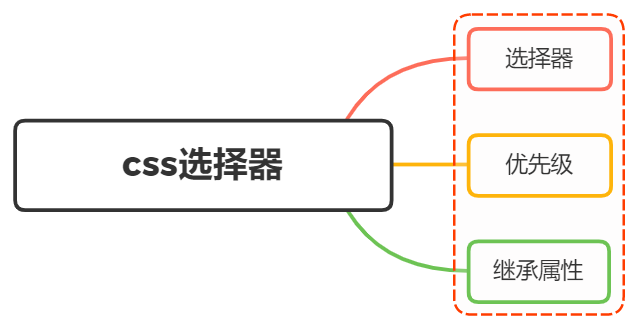

# CSS selectors

<br>
<h1>CSS 选择器有哪些？优先级？哪些属性可以继承？</h1>



## CSS selectors (CSS 选择器)

CSS 选择器是 CSS 规则的第一部分

它是元素和其他部分组合起来告诉浏览器哪个 HTMl 元素应当是被选为应用规划中的 CSS 属性值的方式

选择器所选择的元素，叫做“选择器的对象”

我们从一个 Html 结构开始

```html
<div id="box">
  <div class="one">
    <p class="one_1"></p>
    <p class="one_1"></p>
  </div>
  <div class="two"></div>
  <div class="two"></div>
  <div class="two"></div>
</div>
```

关于 css 属性选择器常用的有以下几种：

- id 选择器（#box），选择 id 为 box 的元素
- 类选择器（.one），选择类名为 one 的所有元素
- 标签选择器（div），选择标签为 div 的所有元素
- 后代选择器（#box div），选择 id 为 box 元素内部所有的 div 元素
- 子选择器（.one>one_1），选择父元素为.one 的所有.one_1 的元素
- 相邻兄弟选择器（.one+two），选择.one 元素后面相邻的所有.two 元素
- 群组选择器（.one,.two），选择所有.one 和.two 元素

还有一些使用频率不高的选择器：

- 伪类选择器
  ```css
  :link ：选择未被访问的链接
  :visited：选取已被访问的链接
  :active：选择活动链接
  :hover ：鼠标指针浮动在上面的元素
  :focus ：选择具有焦点的
  :first-child：父元素的首个子元素
  ```
- 伪元素选择器

  ```css
  ::first-line：选择元素的第一行
  ::first-letter：选择元素的第一个字母
  ::before：在元素之前插入内容
  ::after：在元素之后插入内容
  ```

- 属性选择器

  ```css
  [attribute] 选择带有attribute属性的元素
  [attribute=value] 选择所有使用attribute=value的元素
  [attribute~=value] 选择attribute属性包含value的元素
  [attribute|=value]：选择attribute属性以value开头的元素
  ```

在 CSS3 中新增的选择器有如下：

- 层次选择器（p~ul），选择前面有 p 元素的所有 ul 元素
- 伪类选择器

  ```css
  :first-of-type 表示一组同级元素中其类型的第一个元素
  :last-of-type 表示一组同级元素中其类型的最后一个元素
  :only-of-type 表示没有同类型兄弟元素的元素
  :only-child 表示没有任何兄弟的元素
  :nth-child(n) 根据元素在一组同级中的位置匹配元素
  :nth-last-of-type(n) 匹配给定类型的元素，基于它们在一组兄弟元素中的位置，从末尾开始计数
  :last-child 表示一组兄弟元素中的最后一个元素
  :root 设置HTML文档
  :empty 指定空的元素
  :enabled 选择可用元素
  :disabled 选择被禁用元素
  :checked 选择选中的元素
  :not(selector) 选择与 <selector> 不匹配的所有元素
  ```

- 属性选择器
  ```css
  [attribute*=value]：选择attribute属性值包含value的所有元素
  [attribute^=value]：选择attribute属性开头为value的所有元素
  [attribute$=value]：选择attribute属性结尾为value的所有元素
  ```

## CSS 优先级

CSS 优先级是一组规则，用于确定当多个 CSS 规则应用于同一元素时，哪些规则将胜出

> 内联 > ID > 类 > 标签 > 通配符 > 继承 > 浏览器默认属性

到具体的计算层面，优先级是有 A、B、C、D 的值来决定的，其中它们的值计算规则如下：

- 如果存在内联样式，那么 A = 1，否则 A = 0
- B 的值等于 ID 选择器出现的次数
- C 的值等于类选择器和属性选择器和伪类选择器出现的总次数
- D 的值等于标签选择器和伪元素选择器出现的总次数

例如：

```css
#nav-global > ul > li > a.nav-link;
```

套用上面的计算规则：

- 因为没有内联样式，所以 A = 0
- ID 选择器出现了 1 次，所以 B = 1
- 类选择器出现了 1 次， 属性选择器出现了 0 次，伪类选择器出现 0 次，所以 C = (1 + 0 + 0) = 1
- 标签选择器出现了 3 次，伪元素选择器出现了 0 次，所以 D = (3 + 0) = 3

所以，最终的优先级为 0,1,1,3

知道了优先级是如何计算之后，就来看看比较规则：

- 从左往右依次进行比较，较大者优先级更高
- 如果相等，则比较下一个值
- 如果 4 个值都相等，则后面的会覆盖前面的

经过上面的优先级计算规则，我们知道内联样式的优先级最高，如果外部样式需要覆盖内联样式，那么需要使用 `!important` 来提升优先级

## CSS 可继承属性

在 css 中，有些属性是可以继承的，也就是说，当给父元素设置了这些属性，子元素也会继承这些属性

### 可继承的属性

继承属性可以分为：

- 字体系列属性：

  ```css
  font:组合字体
  font-family:规定元素的字体系列
  font-weight:设置字体的粗细
  font-size:设置字体的尺寸
  font-style:定义字体的风格
  font-variant:偏大或偏小的字体
  ```

- 文本系列属性：

  ```css
  text-indent：文本缩进
  text-align：文本水平对刘
  line-height：行高
  word-spacing：增加或减少单词间的空白
  letter-spacing：增加或减少字符间的空白
  text-transform：控制文本大小写
  direction：规定文本的书写方向
  color：文本颜色
  ```

- 元素可见性：

  ```css
  visibility：是否可见
  ```

- 表格布局属性：

  ```css
  caption-side：定位表格标题位置
  border-collapse：合并表格边框
  border-spacing：设置相邻单元格的边框间的距离
  empty-cells：单元格的边框的出现与消失
  table-layout：表格的宽度由什么决定
  ```

- 列表布局属性：

  ```css
  list-style-type：文字前面的小点点样式
  list-style-position：小点点位置
  list-style：以上的属性可通过这属性集合
  ```

- 引用

  ```css
  quotes：设置引用的前后样式
  ```

- 光标属性：
  ```css
  cursor：光标样式
  ```

继承中比较特殊的几点：

- a 标签的字体颜色不能被继承
- h1-h6 标签字体的大下也是不能被继承的

### 无继承的属性

- display：规定元素应该生成的框的类型
- 文本属性：vertical-align 、 text-decoration
- 盒子模型属性：margin 、 border 、 padding 、 width 、 height 、 min-width 、 max-width 、 min-height 、 max-height 、 overflow
- 背景属性：background 、 background-image 、 background-position 、 background-repeat 、 background-color
- 定位属性：float 、 clear 、 position 、 top 、 right 、 bottom 、 left 、 z-index
- 生成内容属性：content 、 counter-reset 、 counter-increment
- 轮廓样式属性：outline-style 、 outline-width 、 outline-color 、 outline
- 页面样式属性：size 、 page-break-before 、 page-break-after 、 page-break-inside 、 orphans 、 widows

## 参靠

- [CSS selectors](https://developer.mozilla.org/en-US/docs/Web/CSS/CSS_selectors)
- https://vue3js.cn/interview/css/selector.html
