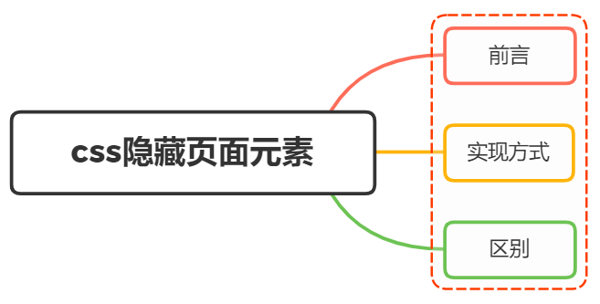

# Hidden element

<br>
<h1>css中，有哪些方式可以隐藏页面元素？区别?</h1>



## 前言

在日常的开发中，我们经常会遇到隐藏元素的需求

通过 css 隐藏元素的方法有很多种，它们看起来实现的效果是一致的

但实际上每一种发放都有一些轻微的不同，这些不同决定了在一些特定场合下使用哪一种方法

## 实现方式

通过 css 实现隐藏元素方法有如下几种：

- `display: none;`
- `visibility: hidden;`
- `opacity: 0;`
- `width: 0; height: 0;`
- `position: absolute;`
- `clip-path`

### `display: none;`

设置元素的 `display` 属性为 `none` ，这是最常用的隐藏元素的方法

```css
.hidden {
  display: none;
}
```

将元素设置为 `display: none;` 之后，元素会从页面中消失，不占据任何空间

元素本身占用的空间会被其他元素占据，也就是说他会导致浏览器的重排和重绘

消失后，自身绑定的事件也会被移除，不会再触发，也不会有过渡效果

特点：元素不可见，不占据空间，不触发事件

### `visibility: hidden;`

设置元素的 `visibility` 属性为 `hidden` ，元素会从页面中消失，但是仍然占据空间

只是当时在一个不可见的状态，不会触发重排，但是会触发重绘

```css
.hidden {
  visibility: hidden;
}
```

给人的效果是隐藏了，所以他自身的事件也不会触发，但是他的子元素事件依然会触发

特点：元素不可见，占据空间，不触发事件

### `opacity: 0;`

设置元素的 `opacity` 属性为 `0` ，元素会从页面中消失，但是仍然占据空间

不会引发重排，一般情况下也会触发重绘

> 如果利用 animation 动画，对 opacity 进行过渡（animation 会默认触发 GPU 加速），则只会触发 GPU 层面的 composite，不会触发重绘

```css
.transparent {
  opacity: 0;
}
```

由于其仍然存在于页面中，所以他的事件依然会触发，但被他遮挡的元素的事件不会触发

需要注意的是，子元素也会被隐藏，且不能够通过设置 opacity 来显示

特点：改变元素透明度，元素不可见，占据页面空间，响应事件

### `width: 0; height: 0;`

将元素的 margin 、 border 、 padding 、width 、 height 等影响盒模型的属性设置为 0
如果元素内有子元素内容，还应该设置其 overflow 为 hidden 来隐藏子元素

```css
.hiddenBox {
  margin: 0;
  border: 0;
  padding: 0;
  height: 0;
  width: 0;
  overflow: hidden;
}
```

特点：元素不可见，不占据空间，不响应事件

### `position: absolute;`

将元素移出可视区域

```css
.hidden {
  position: absolute;
  left: -9999px;
  top: -9999px;
}
```

特点：元素不可见，不影响页面布局

### `clip-path`

通过裁剪的形式

```css
.hide {
  clip-path: polygon(0px 0px, 0px 0px, 0px 0px, 0px 0px);
}
```

特点：元素不可见，占据页面空间，无法响应点击事件

### 小结

最常用的还是 `display:none` 和 `visibility:hidden` ，其他的方式只能认为是奇招，它们的真正用途并不是用于隐藏元素，所以并不推荐使用它们

## 区别

关于 `display: none` 、 `visibility: hidden` 、 `opacity: 0` 的区别，如下表所示：

- ✔️：会、是、能、支持、触发
- ❌：不会、否、不能、不支持、不触发
- ❓：不一定

|                        | display: none | visibility: hidden | opacity: 0 |
| :--------------------: | :-----------: | :----------------: | :--------: |
|        是否存在        |      ❌       |         ✔️         |     ✔️     |
|          重排          |      ✔️       |         ❌         |     ❌     |
|          重绘          |      ✔️       |         ✔️         |     ❓     |
|        绑定事件        |      ❌       |         ❌         |     ✔️     |
|   过渡（transition）   |      ❌       |         ✔️         |     ✔️     |
|      子元素可复原      |      ❌       |         ✔️         |     ❌     |
| 被遮挡的元素可触发事件 |      ✔️       |         ✔️         |     ❌     |

## 参考

- https://www.cnblogs.com/a-cat/p/9039962.html
- https://vue3js.cn/interview/css/hide_attributes.html
