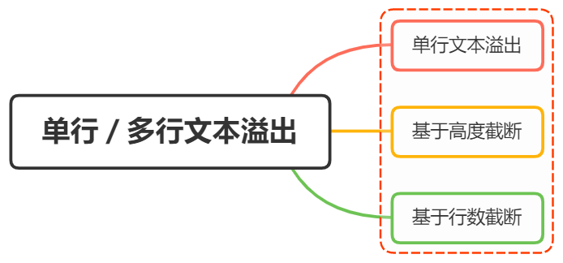

# Text overflew style

<br>
<h1>实现单行/多行文本溢出的省略样式</h1>



## 前言

在日常开发展示页面，如果一段文本的数量过长，受制于元素宽度的因素，有可能不能完全显示，为了提高用户的使用体验，这个时候就需要我们把溢出的文本显示成省略号

对于文本的溢出，我们可以分成两种形式：

- [单行文本溢出](#单行文本溢出)
- [多行文本溢出](#多行文本溢出)

## 实现

### 单行文本溢出

理解也很简单，即文本在一行内显示，超出部分以省略号的形式展现

实现方式也很简单，涉及的 `css` 属性有：

- `text-overflow` ：规定当文本溢出时，显示省略符号来代表被修剪的文本
- `white-space` ：设置文字在一行显示，不能换行
- `overflow` ：文字长度超出限定宽度，则隐藏超出的内容

overflow 设为 hidden，普通情况用在块级元素的外层隐藏内部溢出元素，或者配合下面两个属性实现文本溢出省略

white-space:nowrap，作用是设置文本不换行，是 overflow:hidden 和 text-overflow：ellipsis 生效的基础

text-overflow 属性值有如下：

- clip ：当对象内文本溢出部分裁切掉
- ellipsis ：当文本溢出时显示省略标记（...）

text-overflow 只有在设置了 overflow:hidden 和 white-space:nowrap 才能够生效的

举个例子

```css
.text {
  overflow: hidden;
  line-height: 40px;
  width: 400px;
  height: 40px;
  border: 1px solid red;
  text-overflow: ellipsis;
  white-space: nowrap;
}
```

效果如下：

<p :class="$style.text">
这是一些文本这是一些文本这是一些文本这是一些文本这是一些文本这是一些文本这是一些文本这是一些文本这是一些文本这是一些文本
</p>

可以看到，设置单行文本溢出较为简单，并且省略号显示的位置较好

### 多行文本溢出

多行文本溢出的时候，我们可以分为两种情况：

- [基于高度截断](#基于高度截断)
- [基于行数截断](#基于行数截断)

#### 基于高度截断

伪元素 + 定位

核心的 `css` 代码结构如下：

- `position: relative` ：为伪元素绝对定位
- `overflow: hidden` ：文本溢出限定的高度隐藏内容
- `position: absolute` ：伪元素绝对定位
- `line-height: 20px` ：结合元素高度,高度固定的情况下,设定行高, 控制显示行数
- `height: 30px` ：设定当前元素高度
- `::after {}` ：设置省略号样式

```css
.demo {
  position: relative;
  line-height: 20px;
  height: 40px;
  overflow: hidden;
}
.demo::after {
  content: "...";
  position: absolute;
  bottom: 0;
  right: 0;
  padding: 0 20px 0 10px;
}
```

<div :class='$style.demo'>这是一段很长长长长长长长长长长长长长长长长长长长长长长长长长长长长长长长长长长长长长长长长长长长长长长长长长长长长长长长长长长长长长长长长长长长长长长的文本</div>

实现原理很好理解，就是通过伪元素绝对定位到行尾并遮住文字，再通过 `overflow: hidden` 隐藏多余文字

优点：

- 兼容性好，对各大主流浏览器都支持
- 响应式截断，根据不同宽度做出调整

一般文本存在英文的时候，可以设置 `word-break: break-all` ，使一个单词能够在换行时进行拆分

#### 基于行数截断

纯 `css` 实现也非常简单，核心的 `css` 代码如下：

- `-webkit-line-clamp: 2` ：用来限制在一个块元素显示的文本的行数，为了实现该效果，它需要组合其他的 WebKit 属性）
- `-webkit-box-orient: vertical` ：设置或检索伸缩盒对象的子元素的排列方式
- `display: -webkit-box` ：将对象作为弹性伸缩盒子模型显示
- `overflow: hidden` ：超出部分隐藏
- `text-overflow: ellipsis` ：当对象内文本溢出时显示省略标记

```css
text {
  width: 400px;
  border-radius: 1px solid red;
  -webkit-line-clamp: 2;
  display: -webkit-box;
  -webkit-box-orient: vertical;
  overflow: hidden;
  text-overflow: ellipsis;
}
```

<div :class='$style.text1'>这是一段很长长长长长长长长长长长长长长长长长长长长长长长长长长长长长长长长长长长长长长长长长长长长长长长长长长长长长长长长长长长长长长长长长长长长长长的文本</div>

可以看到，上述使用了 `webkit` 的 `CSS` 属性扩展，所以兼容浏览器范围是 PC 端的 `webkit` 内核的浏览器，由于移动端大多数是使用 `webkit，所以移动端常用该形式`

需要注意的是，如果文本为一段很长的英文或者数字，则需要添加 `word-wrap: break-word` 属性

还能通过使用 `javascript` 实现配合 `css` ，实现代码如下所示：

```css
.demo1 {
  position: relative;
  width: 400px;
  line-height: 20px;
  overflow: hidden;
}
.p-after:after {
  content: "...";
  position: absolute;
  bottom: 0;
  right: 0;
  padding-left: 40px;
  background: -webkit-linear-gradient(left, transparent, #fff 55%);
  background: -moz-linear-gradient(left, transparent, #fff 55%);
  background: -o-linear-gradient(left, transparent, #fff 55%);
  background: linear-gradient(to right, transparent, #fff 55%);
}
```

javascript 代码如下：

```js
$(function () {
  //获取文本的行高，并获取文本的高度，假设我们规定的行数是五行，那么对超过行数的部分进行限制高度，并加上省略号
  $("p").each(function (i, obj) {
    var lineHeight = parseInt($(this).css("line-height"));
    var height = parseInt($(this).height());
    if (height / lineHeight > 3) {
      $(this).addClass("p-after");
      $(this).css("height", "60px");
    } else {
      $(this).removeClass("p-after");
    }
  });
});
```

<input v-model="text"/>

<p id="demo1" :class='$style.demo1' >{{ text }}</p>

<script setup lang="ts"> 
import { ref, onMounted, watch } from 'vue'

const text = ref('这是一段很长长长长长长长长长长长长长长长长长长长长长长长长长长长长长长长长长长长长长长长长长长长长长长长长长长长长长长长长长长长长长长长长长长长长长长的文本')

onMounted(() => {
  const p = document.getElementById('demo1')
  const styleMap = p.computedStyleMap();
  const lineHieght = styleMap.get('line-height').value;
  const height = p.clientHeight;
  if(height / lineHieght > 2) {
    p.classList.add('p-after')
    p.style.height = '60px'
  } else {
    p.classList.remove('p-after')
  }
})
</script>

<style module lang="scss">
  .text {
    overflow: hidden;
    line-height: 30px;
    width: 400px;
    height: 30px;
    border: 1px solid red;
    text-overflow: ellipsis;
    white-space: nowrap;
  }

  .demo {
    position: relative;
    line-height: 20px;
    height: 40px;
    overflow: hidden;
    border: 1px solid red;
  }
  .demo::after {
    content: "...";
    position: absolute;
    bottom: 0;
    right: 0;
    padding: 0 10px 0 10px;
  }

  .text1 {
    width: 400px;
    border-radius: 1px solid red;
    -webkit-line-clamp: 2;
    display: -webkit-box;
    -webkit-box-orient: vertical;
    overflow: hidden;
    text-overflow: ellipsis;
    border: 1px solid red;
  }

  .demo1 {
    position: relative;
    width: 400px;
    overflow: hidden;
    border: 1px solid red;
  }
  
</style>
<style>
  .p-after:after {
    content: "...";
    position: absolute;
    bottom: 0;
    right: 0;
    padding-left: 40px;
    background: -webkit-linear-gradient(left, transparent, #fff 55%);
    background: -moz-linear-gradient(left, transparent, #fff 55%);
    background: -o-linear-gradient(left, transparent, #fff 55%);
    background: linear-gradient(to right, transparent, #fff 55%);
  }
  </style>
