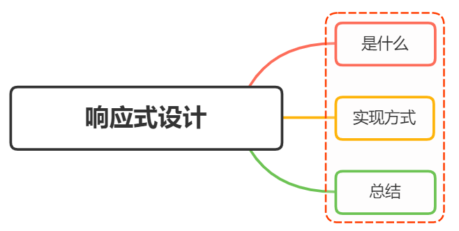

# 什么是响应式设计（Responsive design）？响应式设计的基本原理是什么？如何做？



## 什么是响应式设计（Responsive design）？

响应式网站设计（Responsive Web design）是一种网络页面设计布局，页面的设计与开发应当根据用户行为以及设备环境（系统平台、屏幕尺寸、屏幕定向等）进行相应的响应和调整

描述响应式界面最著名的一句话就是 "Content is like water"

如果将屏幕比作容器，那么内容就是水，无论容器的尺寸大小如何，水都能自动流入容器中，而不会溢出

响应式网站常见特点：

- 同时适配 PC + 平板 + 手机等多个终端
- 标签导航在接近手持终端设备时改变为经典的抽屉式导航
- 网站的布局会根据饰扣来调整模块的大小和位置


## 实现方式

响应式设计的基本原理是通过媒体查询（Media Queries）检测不同的设备屏幕尺寸做处理，为了处理移动端，页面头部必须有 `meta` 声明 `viewport`

```html
<meta name="viewport" content="width=device-width, initial-scale=1, maximum-scale=1, user-scalable=no”>
```

属性对应如下：

- `width=device-width` ：宽度等于当前设备的宽度
- `initial-scale` ：初始缩放比例
- `maximum-scale` ：最大缩放比例
- `user-scalable` ：是否允许用户缩放

实现响应式布局的方式有很多，常见的有：

- 媒体查询（Media Queries）
- 百分比布局
- `vw/vh`
- `rem` 布局

### 媒体查询（Media Queries）

`CSS3` 中的增加了更多的媒体查询，就像 `if` 条件表达式一样，我们可以设置不同类型的媒体条件，并根据对应的条件，给相应符合条件的媒体设置不同的样式

使用 `@media` 查询，可以针对不同的媒体类型定义不同的样式，如：

```css
@media screen and (max-width: 1920px) {
  ...;
}
```

当浏览器窗口在 375px 到 600px 之间时，设置特定字体大小 18px

```css
@media screen (min-width: 375px) and (max-width: 600px) {
  body {
    font-size: 18px;
  }
}
```

通过媒体查询，可以通过给不同分辨率的设备设置不同的样式，从而实现响应式布局

比如我们为不同分辨率的屏幕设置不同的背景图片

比如给小屏幕手机设置@2x 图，为大屏幕手机设置@3x 图，通过媒体查询就能很方便的实现

```css
@media screen and (max-width: 1920px) {
  body {
    background-image: url("1920.jpg");
  }
}

@media screen and (max-width: 1440px) {
  body {
    background-image: url("1440.jpg");
  }
}
```

### 百分比布局

通过百分比单位 `%` 来实现响应式的效果

比如当浏览器的宽度或高度发生变时，通过百分比单位，可以使用浏览器中的组件的宽和高随着浏览器的变化而变化，从而实现响应式布局

`height` 和 `width` 属性的百分比依托于父标签的高度和宽度，但是其他盒子属性则不完全依赖父元素：

- 子元素的 `top/left` 和 `bottom/right` 如果设置为百分比，则相对于直接非 `static` 定位（默认定位）的父元素的宽度计算
- 子元素的 `padding` 如果设置为百分比，不论垂直还是水平方向，都是相对于父元素的 `width` 计算，而与 `height` 无关
- 子元素的 `margin` 如果设置为百分比，不论垂直还是水平方向，都是相对于父元素的 `width` 计算，而与 `height` 无关
- `border-radius` 不一样，如果设置为百分比，则是相对于自身的 `width` 和 `height` 计算

可以看到每个属性都使用百分比，会造成布局的复杂度，所以不建议使用百分比来实现响应式布局

### `vw/vh`

`vw` 表示相对于视图窗口的宽度， `vh` 表示相对于视图窗口的高度。任何层级元素，在使用 `vw/vh` 时，都是相对于视图窗口的宽度和高度计算 `1vw` 等于视图窗口宽度的 `1%`

与百分比布局相似

### `rem`

`rem` 是相对于根元素 `html` 的 `font-size` 计算，默认情况下浏览器字体大小为 `16px`，此时 `1rem` 等于 `16px`

可以利用前面提到的媒体查询，针对不同设备分辨率设置不同的 `font-size`，从而实现响应式布局

```css
@media screen and (max-width: 414px) {
  html {
    font-size: 16px;
  }
}

@media screen and (max-width: 375px) {
  html {
    font-size: 16px;
  }
}

@media screen and (max-width: 320px) {
  html {
    font-size: 16px;
  }
}
```

为了更准确监听设备可视化窗口变化，我们可以再 `css` 之前插入 `script` 标签：

```js
// 动态为 html 标签设置 font-size
function init() {
  // 获取屏幕宽度
  const width = document.documentElement.clientWidth;
  // 计算 font-size 此时为 width 的 1/10
  document.documentElement.style.fontSize = width / 10 + "px";
}

// 首次加载应用，初始化 font-size
init();
// 监听手机旋转事件，重新计算
window.addEventListener("orientationchange", init);
// 监听窗口变化事件，重新计算
window.addEventListener("resize", init);
```

无论设备可视窗口如何变化，始终设置 `rem` 为 `width` 的 1/10 ，实现了 rem 布局

初次之外，我们还可以利用主流的 `UI` 框架，比如 `Element ui` 、 `Ant design` 等，提供的栅格布局实现响应式

### 小结

响应式设计实现通常会从以下几个方面入手：

- 弹性盒子（包括图片、表格、视频）和媒体查询等技术
- 使用百分比布局创建流式布局的弹性 UI，同时使用媒体查询设置元素的尺寸和内容变更范围
- 使用相对单位使用内容自适应调节
- 选择断点，针对不同断点实现不同布局和内容展示

## 总结

### 优点

- 面对不同分辨率设备灵活性强
- 能够快捷解决多设备显示适应问题

### 缺点

- 仅使用布局、信息、框架并不复杂的部门类型网站
- 兼容各种设备工作量大，效率低下
- 代码累赘，会出现隐藏无用的元素，加载时间加长
- 其实这是一种折中性质的设计解决方案，多方面因素影响而达不到最佳效果
- 一定程度上该变了网站原有的布局结构，会出现用户混淆的情况

## 参考

- [Responsive design](https://developer.mozilla.org/en-US/docs/Learn/CSS/CSS_layout/Responsive_design)
- https://juejin.cn/post/6844904082751111176
- https://vue3js.cn/interview/css/responsive_layout.html
