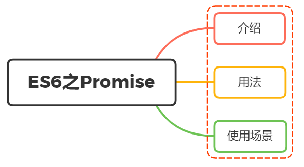

# Promise

<br>
<h1>怎么理解ES6中 Promise的？使用场景？</h1>



## 介绍

`Promise` ，译为“承诺”，是异步编程的一种解决方案，比传统的解决方案（回调函数）和事件——更合理和更强大。

在以往我们如果处理多层异步操作，我们往往会像下面这样写：

```js
doSomething(function (result) {
  doSomethingElse(
    result,
    function (newResult) {
      doThirdThing(
        newResult,
        function (finalResult) {
          console.log("得到最终结果: " + finalResult);
        },
        failureCallback
      );
    },
    failureCallback
  );
}, failureCallback);
```

这样的代码，我们称之为“回调地狱”，代码不仅难以理解，而且不容易扩展。

`Promise` 的出现，让我们可以像写同步代码一样，处理异步操作。

```js
doSomething()
  .then((result) => {
    return doSomethingElse(result);
  })
  .then((newResult) => {
    return doThirdThing(newResult);
  })
  .then((finalResult) => {
    console.log("得到最终结果: " + finalResult);
  })
  .catch(failureCallback);
```

瞬间感受到 `promise` 解决异步操作的优点：

- 链式操作减低了编码难度
- 代码可读性增强，易于维护

下面我们正式来学习 `Promise`。

### 状态

`Promise` 有三种状态：

- `pending` ：等待中，或者进行中，表示还没有得到最终结果
- `fulfilled` ：已经完成，表示得到了我们想要的结果，可以继续往下执行
- `rejected` ：失败了，表示没有得到我们想要的结果，需要进行错误处理

### 特点

- 对象的状态不受外界影响，只有异步操作的结果可以决定当前是哪一种状态
- 一旦状态改变（从 `pedding` 变为 `fulfilled` 和 从 `pedding` 变为 `rejected` ），就不会再变，任何时候都可以得到这个结果

### 流程

`Promise` 的流程图如下：


## 用法

`Promise` 对象是一个构造函数，用来生成 `Promise` 实例。

```js
const promise = new Promise((resolve, reject) => {
  // ... some code

  if (/* 异步操作成功 */) {
    resolve(value);
  } else {
    reject(error);
  }
});
```

`Promise` 构造函数接受一个函数作为参数，该函数的两个参数分别是 `resolve` 和 `reject` 。它们是两个函数，由 JavaScript 引擎提供，不用自己部署。

- `resolve` 函数的作用是，将 `Promise` 对象的状态从“未完成”变为“成功”（即从 `pending` 变为 `fulfilled` ），在异步操作成功时调用，并将异步操作的结果，作为参数传递出去；
- `reject` 函数的作用是，将 `Promise` 对象的状态从“未完成”变为“失败”（即从 `pending` 变为 `rejected` ），在异步操作失败时调用，并将异步操作报出的错误，作为参数传递出去。

### 实例方法

`Promise` 实例存在以下三个方法：

- `then()` ：添加状态改变时的回调函数
- `catch()` ：添加状态变为 `rejected` 时的回调函数
- `finally()` ：添加状态改变时的回调函数，不管状态是 `fulfilled` 还是 `rejected` 都会执行

#### then()

`then` 是实例状态发生改变时的回调函数，第一个参数是 `resolve` 的回调函数，第二个参数（可选）是 `reject` 的回调函数。

```js
const promise = new Promise((resolve, reject) => {});

promise.then(
  (data) => {
    console.log("resolved");
  },
  (error) => {
    console.log("rejected");
  }
);
```

`then` 方法返回的是一个新的 `Promise` 实例，因此可以采用链式写法。

```js
promise()
  .then((data) => {
    // ...
  })
  .then((data) => {
    // ...
  });
```

#### catch()

`catch()` 方法是 `.then(null, rejection)` 或 `.then(undefined, rejection)` 的别名，用于指定发生错误时的回调函数。

```js
promise()
  .then((data) => {
    // ...
  })
  .catch((error) => {
    // 处理 promise 和 前一个回调函数运行时发生的错误
    // ...
  });
```

`Promise` 对象的错误具有“冒泡”性质，会一直向后传递，直到被捕获为止

```js
promise()
  .then((data) => {
    // ...
  })
  .then((data) => {
    // ...
  })
  .catch(function (error) {
    // 处理前面三个Promise产生的错误
  });
```

一般来说，使用 `catch()` 代替 `then()` 的第二个参数更加合理，因为它可以捕获前面所有的错误，而不管是哪个阶段产生的。

`Promise` 对象抛出的错误不会传递到外层代码，即不会有任何反应。

```js
const someAsyncThing = () => {
  return new Promise(function (resolve, reject) {
    // 下面一行会报错，因为x没有声明
    resolve(x + 2);
  });
};
```

浏览器运行到这一行，会打印出错误提示 `ReferenceError: x is not defined` ，但是不会退出进程

`catch()` 方法之中，还能再抛出错误，通过后面 `catch` 方法捕获到

#### finally()

`finally()` 方法用于指定不管 `Promise` 对象最后状态如何，都会执行的操作。

```js
promise
  .then((result) => {})
  .catch((error) => {})
  .finally(() => {});
```

### 构造函数方法

`Promise` 构造函数还提供了以下方法：

- `Promise.all()` ：将多个 `Promise` 实例，包装成一个新的 `Promise` 实例
- `Promise.race()` ：将多个 `Promise` 实例，包装成一个新的 `Promise` 实例
- `Promise.allSettled()` ：将多个 `Promise` 实例，包装成一个新的 `Promise` 实例
- `Promise.resolve()` ：将现有对象转为 `Promise` 对象
- `Promise.reject()` ：返回一个新的 `Promise` 实例，该实例的状态为 `rejected`
- `Promise.try()` ：模拟 `try` 代码块，就像 `try` 代码块一样，如果没有报错，则 `Promise` 对象的状态变为 `resolved` ，否则变为 `rejected`

#### Promise.all()

`Promise.all()` 方法用于将多个 `Promise` 实例，包装成一个新的 `Promise` 实例。

```js
const p = Promise.all([p1, p2, p3]);
```

`Promise.all()` 方法接受一个数组作为参数，数组里面的对象都是 `Promise` 实例，如果不是，就会先调用下面讲到的 `Promise.resolve()` 方法，将参数转为 `Promise` 实例，再进一步处理。

实例 `p` 的状态由 `p1` 、 `p2` 、 `p3` 决定，分成两种情况。

- 只有 `p1` 、 `p2` 、 `p3` 的状态都变成 `fulfilled` ， `p` 的状态才会变成 `fulfilled` ，此时 `p1` 、 `p2` 、 `p3` 的返回值组成一个数组，传递给 `p` 的回调函数。
- 只要 `p1` 、 `p2` 、 `p3` 之中有一个被 `rejected` ， `p` 的状态就变成 `rejected` ，此时第一个被 `reject` 的实例的返回值，会传递给 `p` 的回调函数。

注意：如果作为参数的 `Promise` 实例，自己定义了 `catch` 方法，那么它一旦被 `rejected` ，并不会触发 `Promise.all()` 的 `catch` 方法。

```js
const p1 = new Promise((resolve, reject) => {
  resolve("hello");
})
  .then((result) => result)
  .catch((e) => e);

const p2 = new Promise((resolve, reject) => {
  throw new Error("报错了");
})
  .then((result) => result)
  .catch((e) => e);

Promise.all([p1, p2])
  .then((result) => console.log(result))
  .catch((e) => console.log(e));
// ["hello", Error: 报错了]
```

如果 p2 没有自己的 catch 方法，就会调用 Promise.all()的 catch 方法

```js
const p1 = new Promise((resolve, reject) => {
  resolve("hello");
}).then((result) => result);

const p2 = new Promise((resolve, reject) => {
  throw new Error("报错了");
}).then((result) => result);

Promise.all([p1, p2])
  .then((result) => console.log(result))
  .catch((e) => console.log(e));
// Error: 报错了
```

#### Promise.race()

`Promise.race()` 方法同样试讲多个 `Promise` 实例，包装成一个新的 `Promise` 实例。

```js
const p = Promise.race([p1, p2, p3]);
```

只要 p1 、 p2 、 p3 之中有一个实例率先改变状态，p 的状态就跟着改变

率先改变的 Promise 实例的返回值则传递给 p 的回调函数

```js
const p = Promise.race([
  fetch("/resource-that-may-take-a-while"),
  new Promise(function (resolve, reject) {
    setTimeout(() => reject(new Error("request timeout")), 5000);
  }),
]);

p.then(console.log).catch(console.error);
```

#### Promise.allSettled()

`Promise.allSettled()` 方法接受一组 `Promise` 实例作为参数，包装成一个新的 Promise 实例。

只有等到所有这些参数实例都返回结果，不管是 `fulfilled` 还是 `rejected` ，包装实例才会结束。该方法由 `ES2020` 引入。

```js
const promises = [fetch("/api-1"), fetch("/api-2"), fetch("/api-3")];

await Promise.allSettled(promises);
removeLoadingIndicator();
```

上面代码对服务器发出三个请求，等到三个请求都结束，不管请求成功还是失败，加载的滚动图标就会消失。

该方法返回的新的 `Promise` 实例，一旦结束，状态总是 `fulfilled` ，不会变成 `rejected` 。状态变成 `fulfilled` 后，数组的每个成员包含对象，每个对象都有 `status` 和 `value` 两个属性，`status` 的值只可能是字符串 `fulfilled` 或字符串 `rejected` ，`value` 属性返回 `Promise` 的返回值。

```js
const promises = [
  new Promise((resolve, reject) => {
    resolve(111);
  }),
  new Promise((resolve, reject) => {
    reject("222");
  }),
  new Promise((resolve, reject) => {
    resolve([333]);
  }),
];
Promise.allSettled(promises)
  .then((result) => console.log(result))
  .catch((e) => console.log(e));

// [
//   { status: "fulfilled", value: 111 },
//   { status: "rejected", reason: "222" },
//   { status: "fulfilled", value: [333] },
// ];
```

#### Promise.resolve()

`Promise.resolve()` 方法将现有对象转为 `Promise` 对象。

```js
Promise.resolve("foo");
// 等价于
new Promise((resolve) => resolve("foo"));
```

参数可以分成四种情况，分别如下：

- 参数是一个 `Promise` 实例，那么 `Promise.resolve` 将不做任何修改、原封不动地返回这个实例。
- 参数是一个 `thenable` 对象，`Promise.resolve` 方法会将这个对象转为 `Promise` 对象，然后就立即执行 `thenable` 对象的 `then` 方法。
- 参数不是具有 `then` 方法的对象，或根本就不是对象，`Promise.resolve` 方法返回一个新的 `Promise` 对象，状态为 `resolved` 。
- 不带有任何参数，直接返回一个 `resolved` 状态的 `Promise` 对象。

#### Promise.reject()

`Promise.reject()` 方法也会返回一个新的 `Promise` 实例，该实例的状态为 `rejected` 。

```js
const p = Promise.reject("出错了");
// 等同于
const p = new Promise((resolve, reject) => reject("出错了"));

p.then(null, function (s) {
  console.log(s); // 出错了
});
```

注意，`Promise.reject()`方法的参数，会原封不动地作为 `reject` 的理由，变成后续方法的参数。这一点与 `Promise.resolve` 方法不一致。

```js
Promise.reject("出错了").catch((e) => {
  console.log(e === "出错了"); // true
});
```

#### Promise.try()

`Promise.try()` 方法模拟 `try` 代码块，就像 `try` 代码块一样，如果没有报错，则 `Promise` 对象的状态变为 `resolved` ，否则变为 `rejected` 。

```js
const f = () => console.log("now");
Promise.try(f);
console.log("next");
// now
// next
```

`Promise.try()` 也可以捕获函数 f 执行中的错误。

```js
const f = () => console.log("now");
Promise.try(f)
  .then(() => {
    console.log("next");
  })
  .catch((e) => {
    console.log(e);
  });
// now
// next
```

## 应用

- 将图片的加载写成一个 `Promise` ，一旦加载完成， `Promise` 的状态就发生变化

  ```js
  const preloadImage = function (path) {
    return new Promise(function (resolve, reject) {
      const image = new Image();
      image.onload = resolve;
      image.onerror = reject;
      image.src = path;
    });
  };
  ```

- 通过链式操作，将多个渲染数据分别给个 `then` ，让其各司其职。或当下个异步请求依赖上个请求结果的时候，我们也能够通过链式操作友好解决问题

  ```js
  // 各司其职
  getInfo()
    .then((res) => {
      let { bannerList } = res;
      //渲染轮播图
      console.log(bannerList);
      return res;
    })
    .then((res) => {
      let { storeList } = res;
      //渲染店铺列表
      console.log(storeList);
      return res;
    })
    .then((res) => {
      let { categoryList } = res;
      console.log(categoryList);
      //渲染分类列表
      return res;
    });
  ```

- 通过 `all()` 实现多个请求合并在一起，汇总所有请求结果，只需设置一个 `loading` 即可

  ```js
  function initLoad() {
    // loading.show() //加载loading
    Promise.all([getBannerList(), getStoreList(), getCategoryList()])
      .then((res) => {
        console.log(res);
        loading.hide(); //关闭loading
      })
      .catch((err) => {
        console.log(err);
        loading.hide(); //关闭loading
      });
  }
  //数据初始化
  initLoad();
  ```

- 通过 `race` 可以设置图片请求超时

  ```js
  //请求某个图片资源
  function requestImg() {
    var p = new Promise(function (resolve, reject) {
      var img = new Image();
      img.onload = function () {
        resolve(img);
      };
      //img.src = "https://b-gold-cdn.xitu.io/v3/static/img/logo.a7995ad.svg"; 正确的
      img.src = "https://b-gold-cdn.xitu.io/v3/static/img/logo.a7995ad.svg1";
    });
    return p;
  }

  //延时函数，用于给请求计时
  function timeout() {
    var p = new Promise(function (resolve, reject) {
      setTimeout(function () {
        reject("图片请求超时");
      }, 5000);
    });
    return p;
  }

  Promise.race([requestImg(), timeout()])
    .then(function (results) {
      console.log(results);
    })
    .catch(function (reason) {
      console.log(reason);
    });
  ```

<script setup lang="ts">
const someAsyncThing = () => {
  return new Promise(function (resolve, reject) {
    // 下面一行会报错，因为x没有声明
    try {
      resolve(x + 2);
    } catch (e) {
      resolve(e);
      console.error(e)
    }
  });
};

someAsyncThing();

const p1 = new Promise((resolve, reject) => {
  resolve("hello");
})
  .then((result) => result)
  .catch((e) => e);

const p2 = new Promise((resolve, reject) => {
  throw new Error("报错了");
})
  .then((result) => result)
  .catch((e) => e);

const p3 = new Promise((resolve, reject) => {
  throw new Error("报错了");
})
  .then((result) => result);

Promise.all([p1, p2])
  .then((result) => console.log(result))
  .catch((e) => console.error(e));

Promise.all([p1, p3])
  .then((result) => console.log(result))
  .catch((e) => console.error(e));

const promises = [
  new Promise((resolve, reject) => {
    resolve(111);
  }),
  new Promise((resolve, reject) => {
    reject("222");
  }),
  new Promise((resolve, reject) => {
    resolve([333]);
  }),
];
Promise.allSettled(promises)
  .then((result) => console.log(result))
  .catch((e) => console.log(e));
</script>

## 参考

- [ES6 Promise](https://es6.ruanyifeng.com/#docs/promise)
- [Promise/A+](https://github.com/promises-aplus/promises-spec)
- [ES 2020](https://www.w3schools.com/js/js_2020.asp)
- https://vue3js.cn/interview/es6/promise.html
