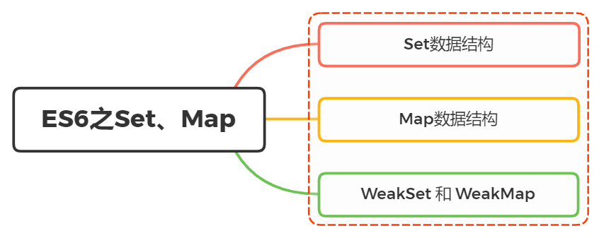

# Set & Map

<h1>怎么理解ES6新增Set、Map两种数据结构的</h1>



如果要用一句来描述，我们可以说
`Set` 是一种叫做集合的数据结构， `Map` 是一种叫做字典的数据结构。

什么是集合？什么又是字典？

- 集合
  是有一堆无序的、相关联的、且不重复的内存结构【数学中成为元素】组成的组合
- 字典
  是一些元素的集合。每个元素有一个称作 key 的域，不同元素的 key 各不相同

区别？

- 共同点：集合、字典都可以存储不重复的值
- 不同点：集合是以 [value, value] 的形式存储元素，字典是以 [key, value] 的形式存储元素

## Set

Set 是 es6 新增的数据结构、类似于数组，但是成员的值都是唯一的，没有重复的值，我们一般称为集合。
Set 本身是一个构造函数，用来生成 Set 数据结构。

```js
const set = new Set();
```

### 属性 & 方法

- size：返回 Set 实例的成员总数。
- add(value)：添加某个值，返回 Set 结构本身。
- delete(value)：删除某个值，返回一个布尔值，表示删除是否成功。
- has(value)：返回一个布尔值，表示该值是否为 Set 的成员。
- clear()：清除所有成员，没有返回值。
- keys()：返回键名的遍历器
- values()：返回键值的遍历器
- entries()：返回键值对的遍历器
- forEach()：使用回调函数遍历每个成员

### add()

添加某个值，返回 Set 结构本身。

当添加实例中已经存在的元素， set 不会进行处理添加

```js
set.add(1).add(2).add(2); // 2只被添加了一次
// Set {1, 2}
```

### delete()

删除某个值，返回一个布尔值，表示删除是否成功。

```js
set.delete(2); // true
set.delete(3); // false
```

### has()

返回一个布尔值，表示该值是否为 Set 的成员。

```js
set.has(1); // true
set.has(3); // false
```

### clear()

清除所有成员，没有返回值。

```js
set.clear();
```

### 遍历

Set 遍历的方法有如下：

- keys()：返回键名的遍历器
- values()：返回键值的遍历器
- entries()：返回键值对的遍历器
- forEach()：使用回调函数遍历每个成员

Set 的遍历顺序就是插入顺序

keys 方法、 values 方法、 entries 方法返回的都是遍历器对象

```js
let set = new Set(["red", "green", "blue"]);

for (let item of set.keys()) {
  console.log(`key:`, item);
}
// key: red
// key: green
// key: blue

for (let item of set.values()) {
  console.log(`value:`, item);
}
// value: red
// value: green
// value: blue

for (let item of set.entries()) {
  console.log(`entry:`, item);
}
// entry: ["red", "red"]
// entry: ["green", "green"]
// entry: ["blue", "blue"]
```

forEach() 用于对每个成员执行某种操作，没有返回值，键值、键名都相等，同样的 forEach()方法还可以有第二个参数，表示绑定的 this 对象。

```js
let set = new Set([1, 2, 3]);
set.forEach((value, key) =>
  console.log(`key:`, key, `value^2:`, value * value)
);
// key: 1 value^2: 1
// key: 4 value^2: 4
// key: 9 value^2: 9
```

扩展运算符（...）和 Set 结构相结合实现数组或字符串去重

```js
// 数组去重
let arr = [1, 2, 3, 4, 4, 5, 5, 6];
let unique = [...new Set(arr)]; // [1, 2, 3, 4, 5, 6]

// 字符串去重
let str = "ababbc";
let unique = [...new Set(str)].join(""); // abc
```

实现并集、交集、差集

```js
let a = new Set([1, 2, 3]);
let b = new Set([4, 3, 2]);

// 并集
let union = new Set([...a, ...b]); // Set {1, 2, 3, 4}

// 交集
let intersect = new Set([...a].filter((x) => b.has(x))); // set {2, 3}

// （a 相对于 b 的） 差集
let difference = new Set([...a].filter((x) => !b.has(x))); // Set {1}
```

## Map

Map 是 es6 新增的数据结构、类似于对象，但是键的范围不限于字符串，各种类型的值（包括对象）都可以当作键。

Map 本身是一个构造函数，用来生成 Map 数据结构。

```js
const map = new Map();
```

### 属性 & 方法

- size：返回 Map 实例的成员总数。
- set(key, value)：设置键名 key 对应的键值为 value，然后返回整个 Map 结构。如果 key 已经有值，则键值会被更新，否则就新生成该键。
- get(key)：读取 key 对应的键值，如果找不到 key，返回 undefined。
- has(key)：返回一个布尔值，表示某个键是否在当前 Map 对象之中。
- delete(key)：删除某个键，返回 true。如果删除失败，返回 false。
- clear()：清除所有成员，没有返回值。
- keys()：返回键名的遍历器
- values()：返回键值的遍历器
- entries()：返回键值对的遍历器
- forEach()：使用回调函数遍历每个成员

### size

返回 Map 实例的成员总数。

```js
const map = new Map();
map.set("foo", true);
map.set("bar", false);

map.size; // 2
```

### set()

设置键名 key 对应的键值为 value，然后返回整个 Map 结构。

如果 key 已经有值，则键值会被更新，否则就新生成该键。

同时返回的是当前的 Map 对象，因此可以采用链式写法。

```js
const map = new Map();

map.set("edition", 6); // 键是字符串
map.set(262, "standard"); // 键是数值
map.set(undefined, "nah"); // 键是 undefined
map.set(1, "one").set(2, "two"); // 采用链式写法
```

### get()

读取 key 对应的键值，如果找不到 key，返回 undefined。

```js
const map = new Map();

const hello = function () {
  console.log("hello");
};

map.set(hello, "Hello ES6!"); // 键是函数

map.get(hello); // Hello ES6!
```

### has()

返回一个布尔值，表示某个键是否在当前 Map 对象之中。

```js
const map = new Map();

map.set("edition", 6);
map.set(262, "standard");
map.set(undefined, "nah");

map.has("edition"); // true
map.has("years"); // false
map.has(262); // true
map.has(undefined); // true
```

### delete()

删除某个键，返回 true。如果删除失败，返回 false。

```js
const map = new Map();

map.set(undefined, "nah");
map.has(undefined); // true

map.delete(undefined);
map.has(undefined); // false
```

### clear()

清除所有成员，没有返回值。

```js
const map = new Map();
map.set("foo", true);
map.set("bar", false);

map.size; // 2
map.clear();
map.size; // 0
```

### 遍历

Map 遍历的方法有如下：

- keys()：返回键名的遍历器
- values()：返回键值的遍历器
- entries()：返回键值对的遍历器
- forEach()：使用回调函数遍历每个成员

Map 的遍历顺序就是插入顺序

keys 方法、 values 方法、 entries 方法返回的都是遍历器对象

```js
const map = new Map([
  ["F", "no"],
  ["T", "yes"],
]);

for (let key of map.keys()) {
  console.log(`key:`, key);
}
// key: F
// key: T

for (let value of map.values()) {
  console.log(`value:`, value);
}
// value: no
// value: yes

for (let item of map.entries()) {
  console.log(`entry:`, item);
}
// entry: ["F", "no"]
// entry: ["T", "yes"]

// 或者
for (let [key, value] of map.entries()) {
  console.log(`key:`, key, `value:`, value);
}
// key: F value: no
// key: T value: yes

// 等同于使用map.entries()
for (let [key, value] of map) {
  console.log(`key:`, key, `value:`, value);
}
// key: F value: no
// key: T value: yes

map.forEach((value, key) => console.log("Key: %s, Value: %s", key, value));
```

## WeakSet & WeakMap

### WeakSet

创建 WeakSet 实例

```js
const ws = new WeakSet();
```

WeakSet 可以接受一个具有 Iterable 接口的对象作为参数

```js
const a = [
  [1, 2],
  [3, 4],
];
const ws = new WeakSet(a);
// WeakSet {[1, 2], [3, 4]}
```

在 API 中 WeakSet 与 Set 有两个区别

- 没有遍历操作的 API
- 没有 size 属性

WeakSet 的成员只能是引用类型，而不能是其他类型的值

```js
const ws = new WeakSet();

// 成员不是引用类型会报错
let weakSet = new WeakSet([2, 3]);
console.log(weakSet); // 报错

// 成员为引用类型
let obj1 = { name: 1 };
let obj2 = { name: 1 };
let ws = new WeakSet([obj1, obj2]);
console.log(ws); //WeakSet {{…}, {…}}
```

WeakSet 里面的引用只要在外部消失，它在 WeakSet 里面的引用就会自动消失

### WeakMap

WeakMap 结构与 Map 结构类似，也是用于生成键值对的集合

在 API 中 WeakMap 与 Map 有两个区别：

- 没有遍历操作的 API
- 没有 clear 清空方法

```js
// WeakMap 可以使用 set 方法添加成员
const wm1 = new WeakMap();
const key = { foo: 1 };
wm1.set(key, 2);
wm1.get(key); // 2

// WeakMap 也可以接受一个数组，
// 作为构造函数的参数
const k1 = [1, 2, 3];
const k2 = [4, 5, 6];
const wm2 = new WeakMap([
  [k1, "foo"],
  [k2, "bar"],
]);
wm2.get(k2); // "bar"
```

WeakMap 只接受对象作为键名（null 除外），不接受其他类型的值作为键名

```js
const map = new WeakMap();
map.set(1, 2);
// TypeError: 1 is not an object!
map.set(Symbol(), 2);
// TypeError: Invalid value used as weak map key
map.set(null, 2);
// TypeError: Invalid value used as weak map key
```

WeakMap 的键名所指向的对象，一旦不再需要，里面的键名对象和所对应的键值对会自动消失，不用手动删除引用

举个场景例子：

在网页的 DOM 元素上添加数据，就可以使用 WeakMap 结构，当该 DOM 元素被清除，其所对应的 WeakMap 记录就会自动被移除

```js
const wm = new WeakMap();

const element = document.getElementById("example");

wm.set(element, "some information");
wm.get(element); // "some information"
```

注意：WeakMap 弱引用的只是键名，而不是键值。键值依然是正常引用

下面代码中，键值 obj 会在 WeakMap 产生新的引用，当你修改 obj 不会影响到内部

```js
const wm = new WeakMap();
let key = {};
let obj = { foo: 1 };

wm.set(key, obj);
obj = null;
wm.get(key);
// Object {foo: 1}
```

## references

- [ES6 Set 和 Map 数据结构](https://es6.ruanyifeng.com/#docs/set-map)
- https://vue3js.cn/interview/es6/set_map.html
