# Java Installation

## Windows

### Step 1: Download JDK

- [Java Downloads](https://www.oracle.com/hk/java/technologies/downloads/)

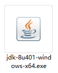

### Step 2: Install JDK

- Run the downloaded installer

- Click `Next` to continue

  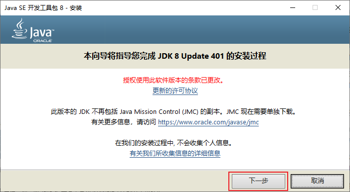

- Choose the installation path

  Choose the path where you want to install the JDK. The default path is `C:\Program Files\Java\-x.x.x`

  

  Choose the path is `D:\Program Files\Java\jdk-x.x.x`

  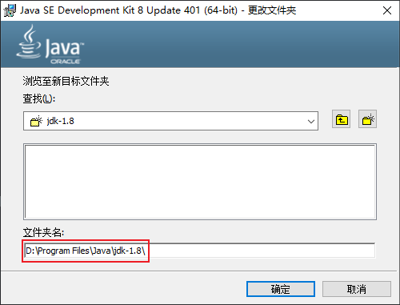

- Click `Next` to continue

  Choose the path where you want to install the JRE. The default path is `C:\Program Files\Java\jre-x.x`

  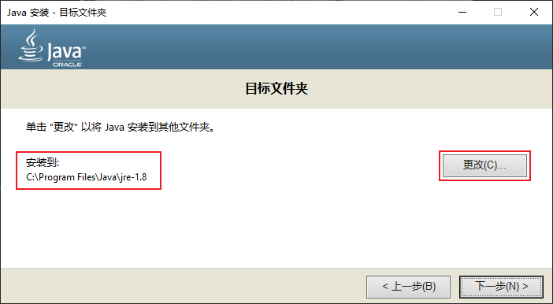

  My JRE path is `D:\Program Files\Java\jre-x.x`. It is the same as the JDK path.

  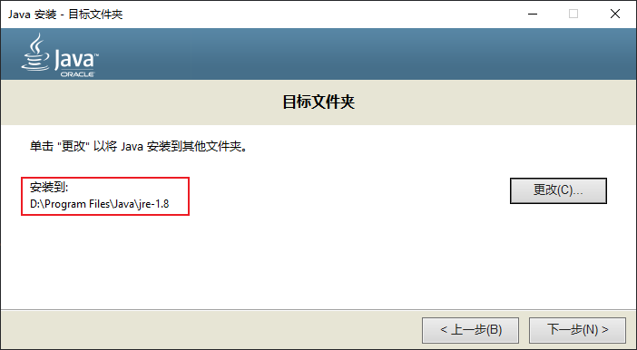

- Click `Next` to continue

  Wait for the installation to complete

  Click `Close` to complete the installation

  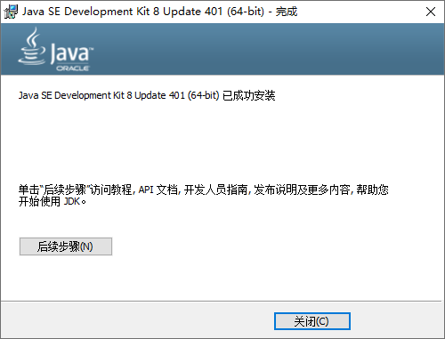

### Step 3: Set Environment Variables

- Right-click on `This PC` and select `Properties`

  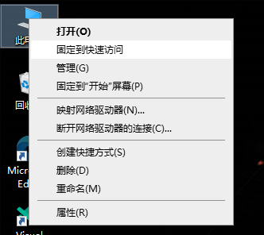

- Click `Advanced system settings`

  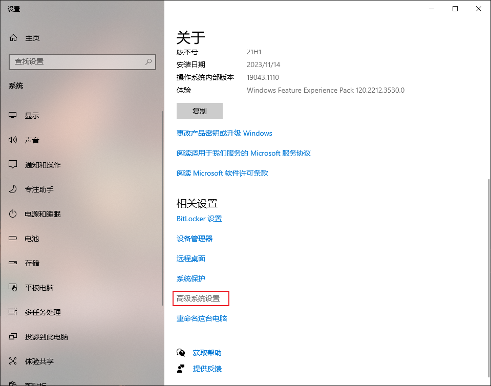

- Click `Environment Variables`

  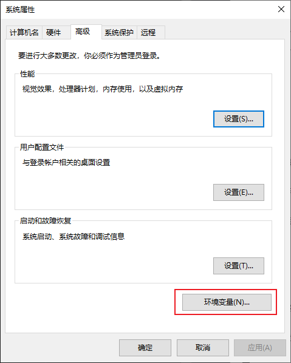

  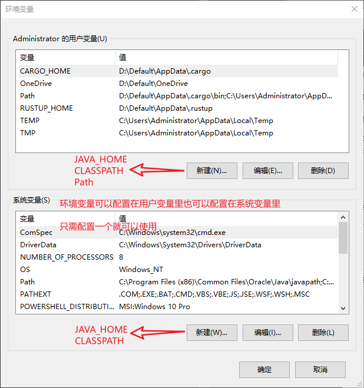

- Click `New` under `Variables`

  - New variable: `JAVA_HOME`

    Variable name: `JAVA_HOME`

    Variable value: `D:\Program Files\Java\jdk-x.x.x`

    `JAVA_HOME` is the path where the JDK is installed on your computer and it is used by many Java applications to find the JDK installation.

    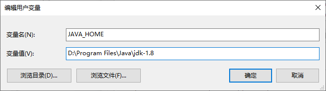

    ::: warning Note
    JDK 和 Eclipse,MyEclipe,AndroidStudio 等软件必须安装位数(Bit)一致(这里 Java jdk 安装的 64bit，所以 Eclipse,MyEclipe,Android Studio 也要安装 64bit)才可以使用，不同位数的程序，会报错无法使用；安装的 JDK，需要卸载 JDK，JDK 不能直接删除文件夹，不然无法再使用 JDK 或无法卸载，如果解压产生的 JDk，可以直接删除。
    :::

  - New variable: `CLASSPATH`

    Variable name: `CLASSPATH`

    Variable value: `.;%JAVA_HOME%\lib;%JAVA_HOME%\lib\tools.jar`

    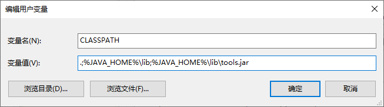

    ::: warning Note
    最前面的 “.;“—点分号。这个是告诉 JDK，搜索 CLASS 时先查找当前目录的 CLASS 文件。这是由于 Linux 的安全机制引起的，LINUX 用户很明白，WINDOWS 用户就很难理解(因为 WINDOWS 默认的搜索顺序是先搜索当前目录的，再搜索系统目录的，再搜索 PATH 环境变量设定的)。

    为什么 CLASSPATH 后面指定了 tools.jar 这个具体文件？这个是由 java 语言的 import 机制和 jar 机制决定的。。
    :::

  - Add `JAVA_HOME` & `CLASSPATH` to `Path`

    Edit `Path` and add `%JAVA_HOME%\bin` and `%JAVA_HOME%\jre\bin` to the end of the value

    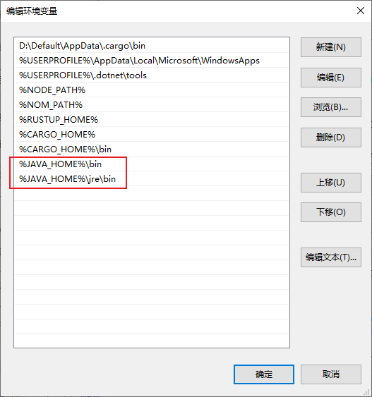

    ::: warning Note
    为什么要设置 Path 环境变量？因为在命令行中，我们可以直接输入 java 命令来运行 java 程序，而不用输入完整的路径。这是因为系统会在 Path 环境变量中查找 java.exe 文件，如果找到了，就可以直接运行。所以，我们需要把 JDK 的 bin 目录添加到 Path 环境变量中。
    :::

  - Click `OK` to save the changes

### Step 4: Verify Installation

- Open a command prompt and type `java -version`

  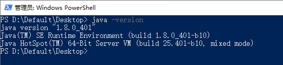

  If you see the version of Java that you installed, then the installation was successful.

::: info JDK 9 之后配置变化
java 9 之后不会生成 jre 文件夹，没有 tools.jar 和 dt.jar 包。
:::

::: info JAVA JDK 9 配置
变量名：JAVA_HOME

变量值：JDK 安装路径

变量名：PATH

变量值：%JAVA_HOME%\bin;
:::

## references

- [Java Downloads](https://www.oracle.com/hk/java/technologies/downloads/)
