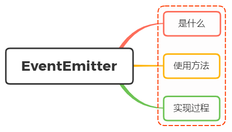

# 对 `Node.js` 中的 `EventEmitter` 的理解？如何实现一个 `EventEmitter` ？



## 1. `EventEmitter` 是什么？

我们了解到， `Node` 采用了事件驱动的方式来处理请求，而 `EventEmitter` 就是 `Node` 中用来处理事件的一个模块，它是 `Node` 实现事件驱动的基石。

在 `EventEmitter` 的基础上， `Node` 几乎所有的模块都继承了这个类，这些模块拥有了自己的事件，可以 _绑定_ / _触发_ 监听器，实现了异步操作。

`Node.js` 里面的许多对象都会分发事件：一个 `net.Server` 对象会在每次有新连接时触发一个事件， 一个 `fs.readStream` 对象会在文件被打开的时候触发一个事件。

这些产生事件的对象都是 `events.EventEmitter` 的实例，这些对象有一个 `eventEmitter.on()` 函数，用于将一个或多个函数绑定到命名事件上。 事件的命名通常是驼峰式的字符串，但也可以使用任何有效的 JavaScript 属性名。

## 2. `EventEmitter` 的使用方法

`Node` 的 `events` 模块只提供了一个 `EventEmitter` 类，这个类实现了 `Node` 异步事件驱动的基础模式————观察者模式

在这种模式中，被观察者（主体）维护着一组其他对象派来（注册）的观察者，有新的对象对注意感兴趣就注册观察者，不感兴趣就取消订阅，注意有更新的话就依次通知观察者

`EventEmitter` 的核心就是事件触发与事件监听器功能的封装

基本代码如下：

```js
const EventEmitter = require("events");

class MyEmitter extends EventEmitter {}
const myEmitter = new MyEmitter();

const callback = () => {
  console.log("触发了event事件！");
};

myEmitter.on("event", callback);
myEmitter.emit("event");
myEmitter.removeListener("event", callback);
```

通过实例对象的 `on` 方法注册一个名为 `event` 的事件，然后通过 `emit` 方法触发这个事件，最后通过 `removeListener` 方法移除这个事件

常见的方法有：

- `emitter.addListener(eventName, listener)` ：为指定事件注册一个监听器，接受一个字符串 `eventName` 和一个回调函数 `listener`，添加类型为 `eventName` 的监听器到监听器数组的尾部，别名 `emitter.on()`

- `emitter.prependListener(eventName, listener)` ：添加监听器到监听器数组的头部，别名 `emitter.addListener()`

- `emitter.emit(eventName[, ...args])` ：按监听器的顺序执行执行每个监听器，如果事件有注册监听返回 `true`，否则返回 `false`

- `emitter.removeListener(eventName, listener)` ：移除指定事件的某个监听器，监听器必须是该事件已经注册过的监听器，它接受两个参数，第一个是事件名称，第二个是回调函数名称，移除指定事件的某个监听器，`emitter.removeListener()` 如果移除了事件的监听器返回 `true`，否则返回 `false`，别名 `emitter.off()`

- `emitter.once(eventName, listener)` ：为指定事件注册一个单次监听器，即监听器最多只会触发一次，触发后立即解除该监听器，别名 `emitter.one()`

- `emitter.removeAllListeners([eventName])` ：移除所有事件的所有监听器，如果指定事件，则移除指定事件的所有监听器

## 3. `EventEmitter` 的实现

通过上面的方法了解， `EventEmitter` 是一个构造函数，内部存在一个包含所有时间的对象

```js
class EventEmitter {
  constructor() {
    this.events = {};
  }
}
```

其中 `events` 存放的监听事件的函数的结构如下：

```js
{
  eventName1: [listener1, listener2, ...],
  eventName2: [listener1, listener2, ...],
  ...
}
```

然后开始一步步实现 `EventEmitter` 的方法
首先是 `emit` ，第一个参数为事件的类型，第二个参数开始为触发事件函数的参数，实现如下：

```js
emit(type, ...args) {
  if (this.events[type]) {
    this.events[type].forEach((listener) => {
      listener.apply(this, args);
    });
  }
}
```

当实现了 `emit` 方法之后，然后实现 `on` 、 `addListener` 、 `prependListener` 这三个实例方法，都是添加事件监听器，只是添加的位置不同，实现如下：

```js
on(type, listener) {
  if (!this.events[type]) {
    this.events[type] = [];
  }
  this.events[type].push(listener);
}

addListener(type, listener) {
  this.on(type, listener);
}

prependListener(type, listener) {
  if (!this.events[type]) {
    this.events[type] = [];
  }
  this.events[type].unshift(listener);
}
```

紧接着就是实现 `removeListener` 、 `off` 、 `removeAllListeners` 这三个实例方法，都是移除事件监听器，实现如下：

```js
removeListener(type, listener) {
  if (this.events[type]) {
    this.events[type] = this.events[type].filter((l) => l !== listener);
  }
}

off(type, listener) {
  this.removeListener(type, listener);
}

removeAllListeners(type) {
  if (this.events[type]) {
    delete this.events[type];
  }
}
```

最后实现 `once` 方法，再传入事件监听处理函数的时候进行封装，利用闭包的特性维护当前状态，通过 `fired` 属性值判断事件函数是否执行过：

```js
// once(type, listener) {
//   const only = (...args) => {
//     listener.apply(this, args);
//     this.removeListener(type, only);
//   };
//   only.fired = false;
//   this.on(type, only);
// }

once(type, handler) {
  this.on(type, this._onceWrap(type, handler, this));
}

_onceWrap(type, handler, target) {
  const state = { fired: false, handler, type , target};
  const wrapFn = this._onceWrapper.bind(state);
  state.wrapFn = wrapFn;
  return wrapFn;
}

_onceWrapper(...args) {
  if (!this.fired) {
    this.fired = true;
    Reflect.apply(this.handler, this.target, args);
    this.target.off(this.type, this.wrapFn);
  }
}
```

完整代码如下：

```js
class EventEmitter {
  constructor() {
    this.events = {};
  }

  on(type, handler) {
    if (!this.events[type]) {
      this.events[type] = [];
    }
    this.events[type].push(handler);
  }

  addListener(type, handler) {
    this.on(type, handler);
  }

  prependListener(type, handler) {
    if (!this.events[type]) {
      this.events[type] = [];
    }
    this.events[type].unshift(handler);
  }

  removeListener(type, handler) {
    if (!this.events[type]) {
      return;
    }
    this.events[type] = this.events[type].filter((item) => item !== handler);
  }

  off(type, handler) {
    this.removeListener(type, handler);
  }

  emit(type, ...args) {
    this.events[type].forEach((item) => {
      Reflect.apply(item, this, args);
    });
  }

  once(type, handler) {
    this.on(type, this._onceWrap(type, handler, this));
  }

  _onceWrap(type, handler, target) {
    const state = { fired: false, handler, type, target };
    const wrapFn = this._onceWrapper.bind(state);
    state.wrapFn = wrapFn;
    return wrapFn;
  }

  _onceWrapper(...args) {
    if (!this.fired) {
      this.fired = true;
      Reflect.apply(this.handler, this.target, args);
      this.target.off(this.type, this.wrapFn);
    }
  }
}
```

测试代码如下：

```js
const emitter = new EventEmitter();

// 注册所有事件
emitter.once("wakeUp", (name) => {
  console.log(`${name} 1`);
});
emitter.on("eat", (name) => {
  console.log(`${name} 2`);
});
emitter.on("eat", (name) => {
  console.log(`${name} 3`);
});
const meetingFn = (name) => {
  console.log(`${name} 4`);
};
emitter.on("work", meetingFn);
emitter.on("work", (name) => {
  console.log(`${name} 5`);
});

emitter.emit("wakeUp", "xx");
emitter.emit("wakeUp", "xx"); // 第二次没有触发
emitter.emit("eat", "xx");
emitter.emit("work", "xx");
emitter.off("work", meetingFn); // 移除事件
emitter.emit("work", "xx"); // 再次工作
```

## 4.参考

- [Node.js Events](https://nodejs.org/api/events.html)
- https://segmentfault.com/a/1190000015762318
- https://juejin.cn/post/6844903781230968845
- https://vue3js.cn/interview/NodeJS/EventEmitter.html
