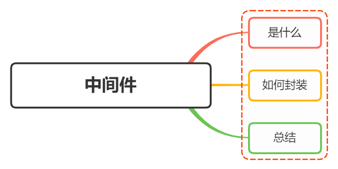

# 对中间件概念的理解，如何封装 `node` 中间件？



## 什么是中间件

中间件（ `Middleware` ）是介于应用系统和系统软件之间的一类软件，它使用系统软件所提供的基础服务（功能），衔接网络上应用系统的各个部分或不同的应用，能够达到资源共享、功能共享的目的

在 `Node.js` 中，中间件主要是封装 `http` 请求细节处理的方法

例如在 `express` 、 `koa` 等 `web` 框架中，中间件的本质为一个回调函数，参数包含请求对象、响应对象和执行下一个中间件的函数


在这些中间件函数中，我们可以执行业务逻辑代码，修改请求和响应对象，返回响应结果，或者执行下一个中间件

## 封装

`koa` 是基于 `Node.js` 当前比较流行的 `web` 框架，本身支持的功能并不多，功能都可以通过中间件拓展实现。通过添加不同的中间件，实现不同的需求，从而构建一个 `koa` 应用

`koa` 中间件采用的是 [洋葱模型](#参考) ，即请求从外到内，响应从内到外，每次执行下一个中间件传入另两个参数：

- `ctx`：上下文对象，包含 `request` 和 `response` 对象
- `next`：执行下一个中间件的函数

下面就针对 `koa` 进行中间件的封装：

`koa` 的中间件就是一个函数，可以是 `async` 函数，或是普通函数

```js
// async 函数
app.use(async (ctx, next) => {
  const start = Date.now();
  await next();
  const ms = Data.now() - start;
  console.log(`${ctx.method} ${ctx.url} - ${ms}ms`);
});

// 普通函数
app.use((ctx, next) => {
  const start = Date.now();
  return next().then(() => {
    const ms = Data.now() - start;
    console.log(`${ctx.method} ${ctx.url} - ${ms}ms`);
  });
});
```

下面则通过中间件封装 `http` 请求过程中几个常用的功能：

### `token` 验证

```js
module.exports = (opyions) => async (ctx, next){
  try {
    // 获取请求头中的 token
    const token = ctx.request.headers['authorization'];
    if(token){
      try {
        // verify 函数验证 token，并获取用户相关信息
        await verify(token)
      } catch (err) {
        // token 验证失败
        ctx.status = 401;
        ctx.body = {
          code: 401,
          message: 'token 验证失败'
        }
      }
    }
    // 进入下一个中间件
    await next()
  } catch (err) {
    console.log(err)
  }
}
```

### 日志模块

```js
const fs = require("fs");

module.exports = (options) => async (ctx, next) => {
  const startTime = Date.now();
  const requestTime = new Date();
  await next();
  const ms = Data.now() - startTime;
  let log = `${ctx.request.ip} -- ${requestTime} -- ${ctx.method} -- ${ctx.url} -- ${ms}ms`;
  // 输出日志文件
  fs.appendFileSync("./log.txt", log + "\n");
};
```

`koa` 存在很多第三方的中间件，例如 `koa-bodyparser` 、 `koa-router` 、 `koa-static` 等，这些中间件都是通过封装 `http` 请求细节实现的

下面再来看看他们的大体的简单实现：

### `koa-bodyparser`

`koa-bodyparser` 中间件是将我们的 `post` 请求和表单提交的查询字符串转换成对象，并挂在 `ctx.request.body` 对象上，方便我们在其他中间件或接口处取值

```js
// file: my-koa-bodyparser.js

const querystring = require("querystring");

module.exports = function bodyParser() {
  return async (ctx, next) => {
    await new Promise((resolve, reject) => {
      // 存储请求体数据
      let arr = [];

      // 接收数据
      ctx.req.on("data", (chunk) => {
        arr.push(chunk);
      });

      // 整合数据并使用 Promise 返回
      ctx.req.on("end", () => {
        // 获取请求数据的类型 json 或表单
        let contentType = ctx.get("Content-Type");

        // 获取数据 Buffer 格式
        let data = Buffer.concat(arr).toString();

        if (contentType === "application/x-www-form-urlencoded") {
          // 如果是表单提交，则将查询字符串转换成对象赋值给 ctx.request.body
          ctx.request.body = querystring.parse(data);
        } else if (contentType === "applaction/json") {
          // 如果是 json，则将字符串格式的对象转换成对象赋值给 ctx.request.body
          ctx.request.body = JSON.parse(data);
        }

        // 执行成功的回调
        resolve();
      });
    });

    // 执行下一个中间件
    await next();
  };
};
```

### `koa-router`

`koa-router` 中间件是用来处理路由的，通过封装 `http` 请求细节，实现了路由的功能

```js
// file: my-koa-router.js

module.exports = function router() {
  return async (ctx, next) => {
    // 获取请求方法和请求路径
    let { method, url } = ctx.request;

    // 遍历路由表
    for (let i = 0; i < this.stack.length; i++) {
      let { path, handler, method: m } = this.stack[i];

      // 判断请求方法和请求路径是否匹配
      if (method === m.toLowerCase() && path === url) {
        // 如果匹配，则执行路由对应的处理函数
        return handler(ctx);
      }
    }

    // 如果没有匹配的路由，则执行下一个中间件
    await next();
  };
};
```

### `koa-static`

`koa-static` 中间件是用来处理静态资源的，通过封装 `http` 请求细节，实现了静态资源的功能

```js
// file: my-koa-static.js

const path = require("path");
const fs = require("fs");
const mime = require("mime");
const { promisify } = require("util");

// 将 stat 和 access 方法转换成 Promise
const stat = promisify(fs.stat);
const access = promisify(fs.access);

module.exports = function (dir) {
  return async (ctx, next) => {
    // 将访问的路由处理城绝对路径，这里要使用 path.join 方法，因为 dir 是相对路径 (/)
    let realPath = path.join(dir, ctx.path);

    try {
      // 获取 stat 对象
      let statObj = await stat(realPath);

      // 如果是文件，则设置文件类型并直接响应内容，否则当作文件夹寻找 index.html
      if (statObj.isFile()) {
        ctx.set("Content-Type", `${mime.getType(realPath)};charset=utf-8`);
        ctx.body = fs.createReadStream(realPath);
      } else {
        let filename = path.join(realPath, "index.html");

        // 如果不存在更改文件则执行 catch 中的 next 交给其他中间件处理
        await access(filename);

        // 存在设置文件类型并直接响应内容
        ctx.set("Content-Type", "text/html;charset=utf-8");
        ctx.body = fs.createReadStream(filename);
      }
    } catch (err) {
      await next();
    }
  };
};
```

## 总结

在实现中间件的时候，单个中间件应该足够简单，职责单一，中间件的代码编写应该高效，必要的时候通过缓存重复获取数据

`koa` 本身比较简洁，但是通过中间件的机制能够实现各种所需要的功能，是的 `web` 应用具备良好的 **_拓展性_** 和 **_组合性_**

通过将公共逻辑的处理编写在中间件中，可以不用再每一个接口回调中做重复的处理，减少了冗杂代码，提高了代码的可维护性，过程就如装饰者模式

## 参考

- [koa](https://github.com/koajs/koa)
- [koa 洋葱模型](https://juejin.cn/post/7012031464237694983)
- [koa-bodyparser](https://github.com/koajs/bodyparser)
- [koa-router](https://github.com/koajs/router)
- [koa-static](https://github.com/koajs/static)
- [koa 中间件原理](https://segmentfault.com/a/1190000017897279)
- [koa 中间件机制](https://www.jianshu.com/p/81b6ebc0dd85)
- https://vue3js.cn/interview/NodeJS/middleware.html
