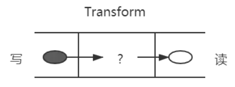

# 对 `Node.js` 中的 `Stream` 的理解？应用场景？


## 1. `Stream` 是什么？

流（ `Stream` ），是一个数据传输手段，是端到端信息交换的一种方式，而且是有顺序的，是逐块读取数据。、处理数据，用于顺序读取输入或写入输出

`Node.js` 中很多对象都实现了流，总之他是会产生数据的对象（一 `Buffer` 为单位），比如 `http` 服务器发起请求、 `fs` 读取文件、 `net` 创建 `TCP` 服务器等等

它的独特之处在于，它不像传统的程序那样一次将一个文件读入内存，而是逐块读取数据、处理其内容，而不是将其全部保存在内存中

流可以分成三部分： `sourec` 、 `dest` 、 `pipe`

在 `source` 和 `dest` 之间有一个连接的管道，可以将 `source` 中的数据传输到 `dest` 中，这个过程就叫做 `pipe`，它的基本语法是 `source.pipe(dest)` ， `source` 和 `dest` 就是通过 `pipe` 连接，让数据从 `source` 流向 `dest`


## 2. `Stream` 的种类

在 `Node.js` 中， 几乎所有的地方都是用到了流的概念，分成四种类型： `Readable` 、 `Writable` 、 `Duplex` 、 `Transform`

- `Readable` ：可读流，用于读取数据，比如 `fs.createReadStream()` 、 `http.request()` 、 `process.stdin` 等等

- `Writable` ：可写流，用于写入数据，比如 `fs.createWriteStream()` 、 `http.response` 、 `process.stdout` 等等

- `Duplex` ：双工流，可读可写，比如 `net.Socket` 等等

- `Transform` ：转换流，可以在数据写入和读取时自改或转换数据的流，例如，在文件压缩操作中，可以向文件写入压缩数据，并从文件中读取解压数据，比如 `zlib.createGzip()` 、 `crypto.createCipher()` 等等

在 `Node.js` 中 `HTTP` 服务器模块中， `request` 和 `response` 对象都是流对象， `request` 对象是一个 `Readable` 流， `response` 对象是一个 `Writable` 流；还有 `fs` 模块中的 `createReadStream()` 和 `createWriteStream()` 方法，分别用于创建 `Readable` 和 `Writable` 流

`Readable` 和 `Writable` 都是单向的，而 `Duplex` 和 `Transform` 是双向的

### `Duplex` 双工流

之前了解过 `websocket` 通信，是一个全双工通信，发送方和接收方都是各自独立的方法，发送和接收都没有任何关系

如下图所示：


基本代码如下：

```js
const { Duplex } = require("stream");

const myDuplex = new Duplex({
  read(size) {
    // ...
  },
  write(chunk, encoding, callback) {
    // ...
  },
});
```

### `Transform` 转换流

`Transform` 是 `Duplex` 的一种，它的作用是可以在写入和读取时修改或转换数据，比如，在文件压缩操作中，可以向文件写入压缩数据，并从文件中读取解压数据

如下图所示：



除了上述压缩包的例子，还比如一个 `babel` ，它可以将 `ES6` 语法转换成 `ES5` 语法，这个过程就是一个转换流

基本代码如下：

```js
const { Transform } = require("stream");

const myTransform = new Transform({
  transform(chunk, encoding, callback) {
    // ...
  },
});
```

## 3. `Stream` 的应用场景

`Stream` 的应用场景主要就是处理 `IO` 操作，而 `http` 请求和文件操作都属于 `IO` 操作

试想一下，如果一次 `IO` 操作的数据量很大，如果一次性将其读取到内存中，那么内存的消耗是非常大的，而且还会造成阻塞，这时候就可以使用 `Stream` 来处理，将此次大的 `IO` 操作分成多次小的 `IO` 操作，这样就可以减少内存的消耗，而且还可以提高性能

常见的应用场景有：

- [`get` 请求返回文件给客户端](#get-请求返回文件给客户端)
- [文件操作](#文件操作)
- [一些打包工具的底层操作](#一些打包工具的底层操作)

### `get` 请求返回文件给客户端

使用 `stream` 流返回文件， `res` 也是一个 `stream` 对象，通过 `pipe` 管道将文件数据返回

```js
const server = http.createServer((req, res) => {
  const method = req.method; // 获取请求方法
  if (method === "GET") {
    // get 请求
    const fileName = path.resolve(__dirname, "data.txt");
    let stream = fs.createReadStream(fileName);
    stream.pipe(res); // 将 res 作为 stream 的 dest
  }
});
server.listen(8000);
```

### 文件操作

创建一个可读数据流 `readStream` ，一个可写数据流 `writeStream` ，通过 `pipe` 管道将数据从 `readStream` 流向 `writeStream`

```js
const fs = require("fs");
const path = require("path");

// 两个文件名
const fileName1 = path.resolve(__dirname, "data.txt");
const fileName2 = path.resolve(__dirname, "data-bak.txt");

// 读取文件的 stream 对象
const readStream = fs.createReadStream(fileName1);

// 写入文件的 stream 对象
const writeStream = fs.createWriteStream(fileName2);

// 通过 pipe 将 readStream 流向 writeStream
readStream.pipe(writeStream);

// 监听读取流的事件
readStream.on("data", (chunk) => {
  console.log(chunk.toString());
});
readStream.on("end", (chunk) => {
  console.log("拷贝完成");
});
```

### 一些打包工具的底层操作

目前一些比较火的前端打包构建工具，都是通过 `stream` 来实现的，比如 `webpack` 、 `gulp` 等等

- `webpack` 的 `loader` 和 `plugin` 都是通过 `stream` 来实现的，比如 `file-loader` 、 `url-loader` 等等

- `gulp` 的 `task` 也是通过 `stream` 来实现的，比如 `gulp.src()` 、 `gulp.dest()` 等等

## 参考

- [Node.js Stream 流](https://nodejs.org/api/stream.html)
- [webpack](https://webpack.js.org/)
- [gulp.js](https://gulpjs.com/)
- https://vue3js.cn/interview/NodeJS/Stream.html
- https://www.barretlee.com/blog/2017/06/06/dive-to-nodejs-at-stream-module/
- https://xie.infoq.cn/article/1a9695020828460eb3c4ff1fa
- https://juejin.cn/post/6844903891083984910
