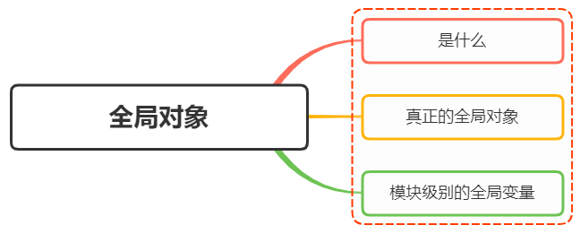
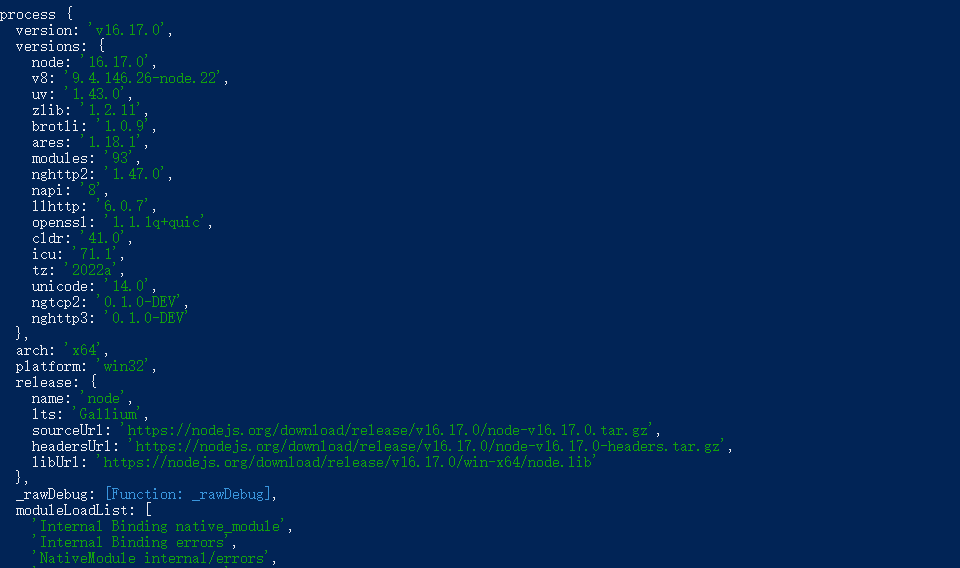
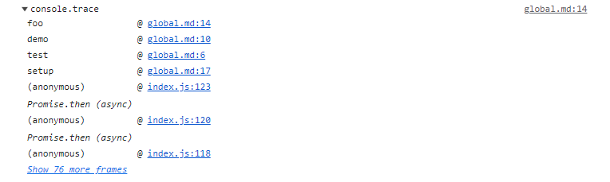

# `Node.js` 有哪些全局对象？



## 1. `global` 是什么

在浏览器 `JavaScript` 中， 通常 `window` 是全局对象， 而在 `Node.js` 中， `global` 就是全局对象， 所有全局变量（除了 `global` 本身以外）都是 `global` 对象的属性。

在 `Node.js` 里，是不可能在最外层定义变量的，因为所有的用户代码都是属于当前模块的， 只在当前模块里可用，而模块本身不是最外层上下文，但可以通过 `exports` 对象的使用将其传递给模块外部

所以，在 `Node.js` 中，用 `var` 声明的变量并不是全局变量，只在当前模块生效

想上述的 `global` 全局对象则在全局作用域中，任何全局变量、函数、对象、都是 `global` 的属性

## 2. `global` 有哪些

将全局对象分成两类

- [真正的全局对象](#真正的全局对象)
- [模块级别的全局对象](#模块级别的全局对象)

### 真正的全局对象

下面给出一些常见的全局对象

- `Class:Buffer`

  可以处理二进制以及非 `Unicode` 编码的数据

  在 `Buffer` 类实例化中存储了原始数据。 `Buffer` 类似于一个整数数组，在 `V8` 堆原始存储空间给它分配了内存

  一旦创建了 `Buffer` ，就不能调整它的大小

- `process`

  进程对象，提供有关当前进程的信息和控制

  包括在执行 `node` 程序进程时，如果需要传递参数，我们想要获取这个参数需要在 `process` 内置对象中获取

  启用进程：

  ```bash
  node index.js --port=8080 --print="hello world" param
  ```

  index.js 文件内容：

  ```js
  process.argv.forEach((val, index) => {
    console.log(`${index}: ${val}`);
  });
  ```

  输出：

  ```bash
  0: /usr/local/bin/node
  1: /test/index.js
  2: --prot=8080
  3: --print=hello world
  4: param
  ```

除此之外，还包括一些其他信息如版本、操作系统等



- `console`

用来打印 `stdout` 和 `stderr` 的对象

最常见的输入内容的方式： `console.log()`

```js
console.log("hello world");
```

清空控制台： `console.clear()`

```js
console.clear();
```

打印函数的调用栈： `console.trace()`

```js
function test() {
  demo();
}

function demo() {
  foo();
}

function foo() {
  console.trace();
}

test();
```



- `setInterval` 、 `clearInterval`

  设置定时器与清除定时器

  ```js
  setInterval(callback, delay[, ...args]);

  clearInterval(intervalObject);
  ```

  `callback` 每 `delay` 毫秒重复执行一次

  `clearInterval` 则为对应的清除定时器

- `setTimeout` 、 `clearTimeout`

  设置定时器与清除定时器

  ```js
  setTimeout(callback,delay[,...args])

  clearTimeout(timeoutObject)
  ```

  `callback` 在 `delay` 毫秒后执行一次

  `clearTimeout` 则为对应的清除定时器

- `global`

  全局命名空间对象，前面讲到的 `process` 、 `console` 、 `setTimeout` 等都是 `global` 的属性

  ```js
  console.log(global.process === process); // true
  ```

### 模块级别的全局对象

这些对象在模块中是可用的，但是不是全局的，因为每个模块都有自己的上下文，看起来像全局变量，像在命令交互中是不可以使用

- `__dirname`

  获取当前文件所在的路径，不包括后面的文件名

  从 `/index` 运行 `node index.js`

  ```js
  console.log(__dirname); // ...\test
  ```

- `__filename`
  获取当前文件所在的路径和文件名称，包括后面的文件名称

  从 `/index` 运行 `node index.js`

  ```js
  console.log(__filename); // ...\test\index.js
  ```

- `exports`

  `module.exports` 用于指定一个模块所导出的内容，即可以通过 `require()` 方法加载的内容

  ```js
  exports.name = name;
  exports.age = age;
  exports.sayHello = sayHello;
  ```

- `module`

  对当前模块的引用，通过 `module.exports` 用于指定一个模块所导出的内容，即可以通过 `require()` 方法加载的内容

- `require()`

  用于引入模块、 `JSON` 、或本地文件。 可以从 `node_modules` 引入模块。

  可以使用相对路径引入本地模块或 `JSON` 文件，路径会根据 `__dirname` 定义的目录名或当前工作目录进行处理

## 4. 参考

- [Node.js global](https://nodejs.org/api/globals.html)
- https://vue3js.cn/interview/NodeJS/global.html

<script setup lang="ts">
  function test() {
    demo();
  }

  function demo() {
    foo();
  }

  function foo() {
    console.trace();
  }

  test();
</script>
