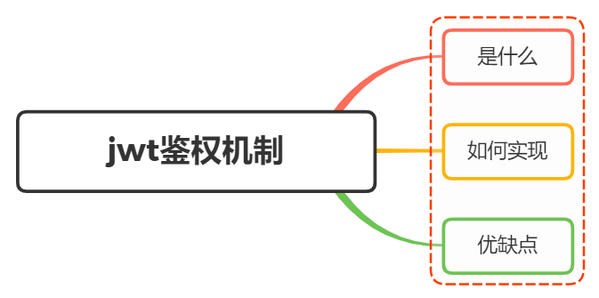

# 如何实现 `JWT` 鉴权机制



## 1. 什么是 `JWT`

`JWT` 是 `JSON Web Token` 的缩写，本质就是一个字符串书写规范，如下图，作用是用来在用户和服务器之间传递安全可靠的信息。

<!-- 是一种基于 `JSON` 的开放标准（`RFC 7519`），用于在网络应用环境间传递声明式信息。`JWT` 通常由三部分组成：头部（`header`）、载荷（`payload`）和签名（`signature`）。 -->

<div class="jwt-example">
  <span class="header">{{ headerbase64 }}.</span><br>
  <span class="payload">{{ payloadbase64 }}.</span><br>
  <span class="signature">{{ signature }}</span>
</div>

在目前前后端分离的开发过程中，使用 `token` 鉴权机制用于身份验证是最常见的方案，流程如下

- 服务器当验证用户账号和密码正确的时候，给用户颁发一个令牌，作为后续用户请求的凭证
- 后续访问会根据这个令牌判断用户是否有权限进行访问

`Token` ，分成了三部分，头部（`header`）、载荷（`payload`）和签名（`signature`），并一 `.` 进行拼接。其中头部和荷载都是以 `JSON` 格式存放数据，只是进行了 `base64` 编码，签名是对前两部分的签名，用于验证数据的完整性。


### 头部（ `header` ）

每个 `JWT` 都会带有头部信息，这里主要声明使用的算法。声明算法的字段名为 `alg` ，同时还有一个 `typ` 字段，表示这个令牌的类型，默认 `JWT` 即可。以下示例中算法为 `HS256` ，表示使用 `HMAC-SHA256` 算法进行签名。

```json-vue
{{ header }}
```

因为 `JWT` 是字符串，所以我们还需要对以上内容进行 `base64` 编码，得到如下结果

```-vue
{{ headerbase64 }}
```

### 载荷（ `payload` ）

载荷即消息体，这里会存放实际的内容，也就是 `Token` 的数据声明，例如用户的 `id` 和 `name` ，默认情况下也会携带令牌的签发时间 `iat` ，以及过期时间 `exp` ，这些都是可选的，但是建议都加上，以提高安全性。如下：

```json-vue
{{ payload }}
```

同时进行 `base64` 编码，得到如下结果

```-vue
{{ payloadbase64 }}
```

### 签名（ `signature` ）

签名是对头部和载荷内容进行签名，一般情况，设置一个 `secretKey` ，对前两个的结果进行 `HMACSHA256` 算法进行签名，使用 `crypto-js` 库进行签名，得到如下结果

```js-vue
const secretKey = "{{ secretKey }}";
const signature = hmacSHA256(base64Url(header) + base64Url(payload), secretKey);
// signature: {{ signature }}
```

最后，将以上三部分用 `.` 进行拼接，得到最终的 `JWT` 字符串

```-vue
{{ JWT }}
```

一旦前面两部分数据被篡改，只要服务器加密用的密钥没有泄露，得到的签名肯定和之前的签名不一致

## 2. 如何实现 `JWT`

`Token` 的会用分成了两部分：

- 生成 `Token` ： 登录成功的时候，颁发 `Token` 给用户
- 验证 `Token` ： 用户访问需要验证的接口的时候，需要验证 `Token` 是否有效

### 生成 `Token`

借助第三方库 `jsonwebtoken` ，通过 `jsonwebtoken` 的 `sign` 方法生成一个 `Token` ，代码如下：

- 第一个参数指的是 `Payload` ，即 `JWT` 的第二部分，存放有效信息的地方，一般存放用户的 `id` 和 `name` 等信息
- 第二个参数指的是 `secretKey` ，即 `JWT` 的第三部分，用于对前两部分进行签名
- 第三个参数指的是 `options` ，即 `JWT` 的第一部分，用于指定生成 `Token` 的一些选项，例如 `algorithm` 指定签名算法，`expiresIn` 指定过期时间，`issuer` 指定签发人等

```js
const crypto = require("crypto"),
  jwt = require("jsonwebtoken");
// TODO:使用数据库
// 这里应该是用数据库存储，这里只是演示用
let userList = [];

class UserController {
  // 用户登录
  static async login(ctx) {
    const data = ctx.request.body;
    if (!data.name || !data.password) {
      return (ctx.body = {
        code: "000002",
        message: "参数不合法",
      });
    }
    const result = userList.find(
      (item) =>
        item.name === data.name &&
        item.password ===
          crypto.createHash("md5").update(data.password).digest("hex")
    );
    if (result) {
      // 生成token
      const token = jwt.sign(
        {
          name: result.name,
        },
        "test_token", // secret
        { expiresIn: 60 * 60 } // 过期时间：60 * 60 s
      );
      return (ctx.body = {
        code: "0",
        message: "登录成功",
        data: {
          token,
        },
      });
    } else {
      return (ctx.body = {
        code: "000002",
        message: "用户名或密码错误",
      });
    }
  }
}

module.exports = UserController;
```

在前端接收到 `token` 之后，一般情况会通过 `loaclStorage` 进行缓存，然后将 `token` 放到 `HTTP` 请求头 `Authorization` 中，关于 `Authorization` 的设置，前面要加上 `Bearer` ，表示 `JWT` 的类型，最后得到的 `Authorization` 的值为 `Bearer ${token}`

```js
axios.interceptors.request.use((config) => {
  const token = localStorage.getItem("token");
  config.headers.common["Authorization"] = "Bearer " + token; // 留意这里的 Authorization
  return config;
});
```

### 验证 `Token`

使用 `koa-jwt` 中间件进行验证，方式比较简单

```js
// 注意：放在路由前面
app.use(
  koajwt({
    secret: "test_token",
  }).unless({
    // 配置白名单
    path: [/\/api\/register/, /\/api\/login/],
  })
);
```

- `secret` 必需和 `sign` 方法中的 `secret` 一致
- 可以通过 `unless` 配置白名单，也就是不需要验证的接口
- 校验的中间件需要放在需要校验的路有前面，无法对前面的路由进行校验

获取 `token` 用户的信息方法如下：

```js
router.get("/api/userInfo", async (ctx, next) => {
  const authorization = ctx.header.authorization; // 获取jwt
  const token = authorization.replace("Beraer ", "");
  const result = jwt.verify(token, "test_token");
  ctx.body = result;
});
```

注意：上述的 `HMA256` 加密算法为单秘钥的形式，一旦泄漏后非常的危险

在分布式系统中，每个子系统都要获取到秘钥，那么这个子系统根据该秘钥可以发布和验证令牌，但有些服务器只需要验证令牌

这时候可以采用非对称加密，利用私钥签发令牌，公钥验证令牌，这样就可以保证私钥不会泄漏，而公钥可以随意发布，加密算法可以选择 `RS256`

## 3. `JWT` 的优缺点

### 优点

- `json` 具有通用性，可以在不同的编程语言中使用
- 组成简单，字节占用小，便于传输
- 服务端无需保存会花信息，很容易进行水平扩展
- 一处生成，多出使用，可以在分布式系统中，解决单点登录问题
- 可防护 `CSRF` 攻击

### 缺点

- `payload` 部分仅仅是进行简单编码，所以只能用于存储逻辑必需的非敏感信息
- 需要保护好加密密钥，一旦泄露后果不堪设想
- 为避免 `token` 被劫持，最好使用 `https` 协议

## 4. 参考

- [crypto-js](https://github.com/brix/crypto-js)
- [jsonwebtoken](https://github.com/auth0/node-jsonwebtoken)
- [koa-jwt](https://github.com/koajs/jwt)
- [JSON Web Token 入门教程](http://www.ruanyifeng.com/blog/2018/07/json_web_token-tutorial.html)
- [JWT 安全验证理解与实践](https://juejin.cn/post/6844903911686406158)
- https://vue3js.cn/interview/NodeJS/jwt.html

<script setup lang="ts">
import { ref } from 'vue';
import hmacSHA256 from 'crypto-js/hmac-sha256';
import base64 from 'crypto-js/enc-base64';
import { v4 as uuidv4 } from 'uuid';

type exemple = {
  [key: string]: string;
};

function base64Url(params: any): string {
  return btoa(JSON.stringify(params));
};

const header: exemple = {
  alg: "HS256",
  typ: "JWT"
};

const headerbase64: string = base64Url(header);

const payload: exemple = {
  id: "1234567890",
  name: "John Doe",
  iat: 1516239022,
  exp: 1516239022
};

const payloadbase64: string = base64Url(payload);

const secretKey: string = uuidv4();

const SHA256 = hmacSHA256(base64Url(header)+ '.' +base64Url(payload), secretKey);

const signature = base64.stringify(SHA256);

const JWT: string = `${headerbase64}.
${payloadbase64}.
${signature}`;
</script>

<style lang="sass">
.jwt-example
  font-family: lxgw wenkai lite,pt serif,noto serif sc,serif
  span
    word-wrap: break-word
  .header
    color: #ff1c5c
  .payload
    color: #d239f1
  .signature
    color: #00b2ea
</style>
