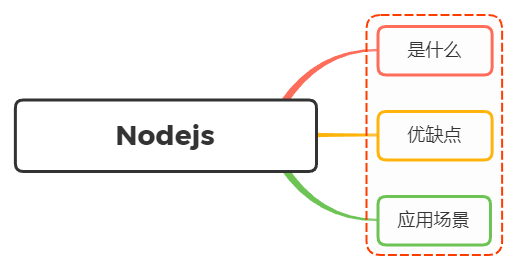

# 对 `Node.js` 的理解？优缺点？应用场景？

## 1. 什么是 `Node.js`？

`Node.js` 是一个开源与跨平台的 `JavaScript` 运行时环境

在浏览器外运行 `V8 JavaScript` 引擎（ `Google Chrome` 的内核），利用事件驱动、非阻塞和异步输入输出模型等技术来提高性能，可优化应用程序的传输量和规模

可以理解为 `Node.js` 是一个服务器端的、非阻塞的 I/O、事件驱动的 `JavaScript` 运行环境

### 非阻塞性异步

`Node.js` 采用了非阻塞型 `I/O` 机制，在做 `I/O` 操作的时候不会造成任何阻塞，以事件的形式通知执行操作

例如在执行了访问数据库的代码之后，将立即转而执行其后面的代码。把数据库返回结果的处理代码放在回调函数中，实现了非阻塞，提高了程序的性能

### 事件驱动

事件驱动就是当进来一个新的请求时，请求将会被压入一个事件队列中，然后通过一个循环来检测队列中的事件状态变化，如果检测到有状态变化的事件，那么就执行改事件对应的处理代码，一般都是回调函数

比如读取一个文件，当文件读取完成后，就会触发一个事件，然后执行回调函数来进行处理

### 单线程

`Node.js` 是单线程的，但是它的 `I/O` 是多线程的，`Node.js` 采用了事件驱动、非阻塞式 I/O 的模型，使其轻量又高效

## 2. `Node.js` 的优缺点

### 优点

- 处理高并发场景性能更加
- 适合 `I/O` 密集型应用，值的是应用在运行极限时， `CPU` 占用率仍然比较低，大部分时间都在做 `I/O` 硬盘内存读写操作

### 缺点

因为 `Node.js` 是单线程的的，带来的缺点有：

- 不适合 `CPU` 密集型应用
- 只支持单核 `CPU` ，不能充分的利用多核 `CPU` 的优势
- 可靠性低，一旦代码某个环节崩溃，整个系统都崩溃

## 3. `Node.js` 的应用场景

借助 `Node.js` 的特点和弊端，其应用场景分类如下：

- 善于 `I/O` ，不善于计算。因为 `Node.js` 是一个单线程，如果计算（同步）太多，则会阻塞这个线程
- 大量并发的 `I/O` ，应用程序内部并不需要进行非常复杂的处理
- 与 `websocket` 配合，开发长连接的实时交互应用程序

具体的应用场景可以表现为如下：

- 第一大类：用户表单收集系统、后台管理系统、实时交互系统、考试系统、联网软件、高并发的 `Web` 应用程序
- 第二大类：基于 `web` 、 `canvas` 等多人联网游戏
- 第三大类：基于 `web` 的多人实时聊天客户端、聊天室、图文直播
- 第四大类：单页面浏览器应用程序
- 第五大类：操作数据库、为前端和移动端提供基于 `json` 的 API

其实， `Node.js` 能实现几乎一切的应用，只考虑适不适合使用它

## 4. 参考

- [Node.js](https://nodejs.org/en)
- https://vue3js.cn/interview/NodeJS/nodejs.html
- https://segmentfault.com/a/1190000019854308
- https://segmentfault.com/a/1190000005173218
