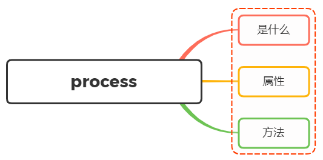

# 对 `Node.js` 中 `process` 的理解？有哪些常用方法？



## `process` 是什么

`process` 对象是一个全局变量，提供了有关当前 `Node.js` 进程的信息并对其进行控制，作为一个全局变量

我们都知道，进程是计算机系统进行资源分配和调度的基本单位，是操作系统结构的基础，是线程的容器

当我们运行一个 `js` 文件，实际就是启动了一个服务进程，每个进程都拥有自己独立的空间地址、数据栈，像另一个进程无法访问当前进程的变量、数据结构，只有数据通信后，进程之间才可以进行数据交换

由于 `JavaScript` 是一个单线程语言，所以通过 `node xxx` 启动一个文件后，只有一条主线程，这个主线程就是 `process` 对象

## `process` 的属性与方法

关于 `process` 常见的属性有如下：

- `process.env`：返回一个包含用户环境信息的对象，例如通过 `process.env.NODE_ENV` 获取不同环境项目配置信息
- `process.nextTick()`：将 `callback` 添加到下一个时间点的队列，这个队列是在所有 `I/O` 事件的回调之后、当前操作结束之前执行的，这个在谈及 `EventLoop` 时经常为会提到
- `process.argv`：返回一个数组，其中包含当启动 `Node.js` 进程时传入的命令行参数
- `process.pid`：返回进程的 `PID`
- `process.ppid`：返回父进程的 `PID`
- `process.cwd()`：返回当前进程的工作目录
- `process.platform`：返回当前进程运行的操作系统平台
- `process.uptime()`：当前进程已运行时间，例如：`pm2` 守护进程的 `uptime` 值
- `process.on()`：监听事件， `process.on("uncaughtException",callback)` 捕获异常信息、 `process.on("exit",callback)` 进程推出监听
- `process.memoryUsage()`：返回一个对象，描述了 `Node.js` 进程所用的内存状况，单位是字节
- `process.kill(pid)`：向进程发送信号，默认为 `SIGTERM` 信号
- `process.send(message[, sendHandle[, options]][, callback])`：向父进程发送消息，父进程通过监听 `message` 事件来接收消息
- `process.title`：设置进程标题，`ps` 命令中显示的进程名
- `process.versions`：返回 `Node.js` 以及其依赖的版本号
- `process.hrtime()`：返回当前进程的高分辨时间，用于精确计时
- `process.exitCode`：进程退出时的退出码，如果进程优雅地退出，那么退出码为 `0`，否则为 `1`
- `process.exit()`：退出当前进程
- 三个标准流： `process.stdout` 标准输出、 `process.stdin` 标准输入、 `process.stderr` 标准错误输出

关于某些方法的使用：

### `process.cwd()`

返回当前 `Node` 进程执行的目录

一个 `Node` 模块 `A` 通过 `NPM` 发布，项目 `B` 中使用了模块 `A` 。在 `A` 中需要操作 `B` 项目下的文件时，可以通过 `process.cwd()` 获取到 `B` 项目的目录，然后进行文件操作

### `process.argv`

在终端通过 `Node` 执行命令的时候，通过 `process.argv` 可以获取到命令行中的参数，返回值是一个数组：

- `process.argv[0]`：`Node` 的可执行文件所在的路径（一般用不到，直接忽略）
- `process.argv[1]`：当前执行脚本文件所在的路径（一般用不到，直接忽略）
- `process.argv[2 ~ n]`：当前执行脚本文件所在路径后的参数

所以，我们只要从 `process.argv[2]` 开始，就可以获取到命令行中的参数了

```js
const args = process.argv.slice(2);
```

### `process.env`

返回一个对象，存储当前环境相关的所有信息，一般很少直接用到。

一般我们会在 `process.env` 上挂载一些变量标识当前的环境。比如最常见的用 `process.env.NODE_ENV` 区分 `development` 和 `production` 环境

在 `vue-cli` 的源码中也经常会看到 `process.env.VUE_CLI_TEST` ，用来标识当前是否处于 `test` 环境、`process.env.VUE_CLI_DEBUG` 用来标识是否处于 `debug` 环境

### `process.nextTick()`

我们知道 `Node.js` 是基于事件轮询，在这个过程中，同一时间只会处理一件事情

在这种处理模式下， `process.nextTick()` 就是定义出一个动作，并且让这个动作在下一个时间轮训的时间点上执行

例如下面例子讲一个 `foo` 函数在下一个时间点调用

```js
function foo() {
  console.log("foo");
}

process.nextTick(foo);
console.log("bar");
```

输出结果为：

```js
bar;
foo;
```

虽然下述方式也能实现同样效果：

```js
setTimeout(foo, 0);
concole.log("bar");
```

两者区别在于：

- `process.nextTick()` 会在这一次 `event loop` 的 `call stack` 清空后（下一次 `event loop` 开始前）执行再调用 callback
- `setTimeout()` 是并不知道什么时候 `call stack` 清空的，所以何时调用 `callback` 函数是不确定的

## 参考

- [Node.js process](https://nodejs.org/api/process.html)
- https://vue3js.cn/interview/NodeJS/process.html
